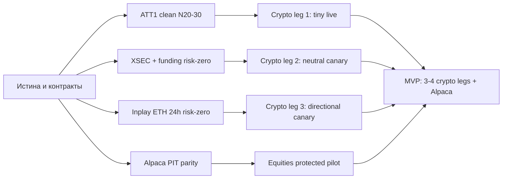

# ДОРОЖНАЯ КАРТА — 11 августа 2026
### Заменяет ROADMAP_2026_08_10. Читать сверху вниз. Обновлять этот файл, новых не плодить.

## CODEx-проверка 19:55 UTC — этот блок имеет приоритет над выводами ниже

### Heartbeat 12 августа, 01:59 UTC

- Пять из пяти supervisor jobs живы, evidence fresh, все `research_only` и
  без live order authority.
- Три локальных public-data collector и изолированный серверный collector
  продолжают сбор без ошибок; свободно 78 GiB локально и 7,3 GiB на VPS,
  storage guards разрешают продолжение.
- Первая завершённая UTC-партиция 20260811 независимо проверена read-only:
  все 12 локальных stream-результатов и 4 серверных результата valid,
  coverage 99,73–100%, дубликатов сделок нет. Локальные reconnect gaps явно
  записаны (1–3 на поток); серверные BTC/ETH партиции gap-free.
- Direct broker read-only: `retCode=0`, `open_position_count=0`.
- Ничего не перезапускалось, риск/live не менялись, ордеров и деплоя не было.

Receipt: `reports/research/L2_TAPE_VALIDATION_2026_08_12.json`.

### Что действительно работает сейчас

| контур | подтверждённое состояние | следующий денежный gate |
|---|---|---|
| Bybit ATT1 | единственный tiny canary, risk multiplier 0.10; брокер был flat при прямых чтениях 19:22 и 20:00 UTC | live↔backtest sizing parity + 20–30 чистых post-fix сделок; затем решение 0.25, не автоматическое повышение |
| XSEC | 17 risk-zero shadow решений, `orders_sent=false`; 60–62 пригодных символа | 20–30 чистых forward-решений, PIT universe, funding/cost reconciliation и executable parity |
| funding | два risk-zero сборщика живы, чистая эпоха после карантина legacy фактически N=0 | минимум 20 закрытых чистых наблюдений после издержек |
| inplay ETH 24h | лучший направленный кандидат, но пока только исследование | замороженный risk-zero collector и 30–50 закрытых событий |
| Alpaca | защищённый пилот около $486, новые входы закрыты; реальные позиции имеют стопы | честный PIT/live-contract backtest, общий executable exit model и parity |
| FX/CFD | текущий пакет дал четыре терминальных отказа | отдельный XAU data/cost contract, затем годовой replay |

Состояние исследовательской станции: **5 из 5 процессов healthy**, у всех
`research_only=true` и `live_order_authority=false`. Дополнительно работают
три локальных и один изолированный серверный публичный L2/tape collector.

### Исправления к опубликованным выводам

1. Шестидневная матрица не `complete`: 48/48 процессов завершились, но
   24/48 строк имеют `audit_rc=1`. Новый статус —
   `incomplete_validation_failures`. Нулевые строки ATT1/horizontal нельзя
   трактовать как отсутствие сигналов или эдж.
2. Детектор уровня переводится из «готов» в **карантин**. Пороги и знак
   выбирались на полном наборе, проверки пересекаются, события перекрываются,
   барьеры несимметричны, а исключение sealed holdout не доказано. Полный
   разбор: `reports/CODEX_LEVEL_DETECTOR_AUDIT_2026_08_11.md`.
3. XSEC остаётся только shadow. На честном search-окне maturity 180/270/390/540
   дало CAGR 8.7% / 12.8% / 7.5% / -5.2% при Sharpe 0.61 / 0.84 / 0.51 / -0.41.
   Это нестабильное семейство, а не обещание годовой доходности.
4. Для Alpaca старые красивые v38-цифры не используются. Текущий exact-parity
   receipt блокирует результат: PIT universe, lifecycle fills, cost/gap,
   survivorship, untouched forward и единый exit model ещё не закреплены.
5. Зарезервированное окно 2025-10..2026-06 остаётся закрытым. Любой старый
   результат, который мог его прочитать без preflight/passport, не допускается
   к продвижению.

### План до минимально рабочей версии



**Ожидаемые сроки — условия, а не обещания:**

- Alpaca: 3–5 рабочих дней на первый parity-инженерный отчёт; 1–2 недели
  на полный PIT/live-contract backtest. До этого `SAFE_HOLD`.
- XSEC: первый денежный review после N20–30 чистых дневных решений —
  ориентировочно 3–6 недель, если экономика и parity пройдут.
- Funding: 4–8 недель по скорости событий до первого review.
- Inplay ETH: collector можно подготовить за 1–3 дня; 30–50 событий обычно
  потребуют 1–3 месяца. Деньги только после этого.
- BTC/ETH medium-term: отдельный pullback/trend пакет — после запуска inplay,
  первый честный replay в горизонте 1–2 недель работы.
- FX/XAU: первые годовые числа — 1–2 недели после data/cost contract;
  приоритет ниже crypto и Alpaca.
- Цель 3–4 независимых crypto legs реалистично проверять в сентябре–ноябре,
  но только при прохождении ворот; календарь не заменяет доказательство.

### Что делаем между сессиями

- Supervisor продолжает Alpaca adaptive shadow, XSEC, два funding shadow и
  proposal-only проектный аудит.
- Heartbeat `trading-research-and-data-continuity-guard` каждые 6 часов
  проверяет процессы, freshness, серверный collector и дисковые guards.
- L2/лента копятся локально и на отдельном серверном venv; без ключей,
  order API и доступа к монолиту. Дисковые caps и stop guards активны.
- DeepSeek/Ollama получает только паспорта, finding/reproduction и публичные
  данные; может предлагать гипотезы и фенотипы убытков, но не менять live,
  риск или ордера.
- Любой эксперимент без `research_lab/run_passport.py` считается
  непригодным для сравнения и promotion.

### Что не делать

- Не давать ИИ прямую торговую власть: это увеличит скорость ошибок, а не
  качество стратегии.
- Не считать dry-run Telegram сигнал сделкой и не засорять основной канал:
  такие события уходят в отдельный research digest.
- Не удалять 482 грязных файла массово. Сначала inventory → reference map →
  reproducibility → scoped archive/delete commit.
- Не переносить live на Mac mini. Он полезен как research/Ollama/data node;
  VPS остаётся независимым execution-контуром.

---

<details>
<summary>Архив исходного черновика Claude — сохранён для трассировки, но не является текущим планом</summary>

> Внимание: ниже сохранены исходные формулировки до Codex-аудита. Их числа и
> вердикты нельзя использовать для live, promotion или оценки доходности без
> повторной проверки через паспорт прогона.

## ГДЕ МЫ — одним экраном

```
работает в live         ATT1 short, canary, риск 0.10
копит forward           XSEC нейтральная, shadow risk=0, 366 прогонов
готово к передаче       предохранитель по каскадам ликвидаций
лучший кандидат         inplay_breakout ETH 24ч — враг назван, фильтр не построен
в карантине             XSEC-пересчёт: вскрыт зарезервированный holdout
закрыто сегодня         элдер, 4 кандидата во 2-ю ногу, таблица битка как фильтр
```

**Центральный факт, изменившийся сегодня.** Раньше считалось, что ноги
умирают об издержки. Теперь известно точнее: **направленную ногу на
горизонте суток невозможно доказать** — нужно 58 лет истории против
наших 3.5. Рыночно-нейтральную можно за 2.6 года. Отсюда всё остальное.

---

## ЧТО ДОКАЗАНО СЕГОДНЯ

| факт | число | где |
|---|---|---|
| горизонт суток меняет арифметику | амплитуда 31x круга против 12x на 6ч | `CLAUDE_HORIZON_STUDY` |
| XSEC действительно нейтральна | бета к BTC +0.08 | `CLAUDE_XSEC_RECOUNT` |
| честный Sharpe XSEC | 0.65 на чужих символах И на современном рынке | там же |
| каскад ликвидаций опасен | ход против входа x1.38 за 30 мин | `research_lab/liq_fuse.py` |
| живых стратегий | 31, а не 13 | `strategy_census.json` |
| враг inplay_breakout | доля стопов x2.3, ход в пользу x0.45 | `window_forensics` |

## ЧТО ЗАКРЫТО СЕГОДНЯ (не переоткрывать без нового аргумента)

| контур | причина |
|---|---|
| элдер `alt_elder_revived_v1` | 9 устойчивых из 30 при ожидаемых 9.4 |
| разворот, размер, низкая вола как 2-я нога | корреляция с XSEC 0.35-0.72 — это XSEC в обёртке |
| поперечная нога по акциям локально | 17 из 20 тикеров листнулись весной 2026 |
| таблица битка как ФИЛЬТР | 0 из 24 клеток прошли порог значимости |

Таблица битка остаётся как **признак**, но не как выключатель.

### Крупное закрытие: уровень сам по себе эджа не даёт

Замерено на **43 013 событиях** по 137 символам за 3.5 года. Событие —
подход цены к недельному экстремуму; исход — гонка барьеров.

```
базовая частота пробоя        42.2%   (уровень держит в 57.8%)
поддержка ломается            43.5%
сопротивление ломается        40.9%
```

Перебрано **72 конфигурации** входа: играть пробой или отскок × ширина
стопа 1/2/3.5/5 ATR × горизонт 4/8/24ч × три состояния подхода.
**Прошло обе проверки (по времени и по символам): 0 из 72.**
Лучший вариант даёт +0.003R — это ноль.

**Механизм закрытия назван:** вероятность и размер хода компенсируют
друг друга. Уровень чаще держит (58%), но когда ломается — идёт далеко,
и это съедает всё, что накопили отскоки.

**Что это объясняет:** почти вся библиотека из 92 файлов построена на
уровнях — отскоки, пробои, ретесты, флэт. Отсутствие эджа у них
теперь объяснено не по одной ноге, а на уровне рыночной структуры.

**Что при этом РАБОТАЕТ в детекторе** (пережило обе проверки):

| признак | медленный | быстрый | разрыв | по времени | по символам |
|---|---|---|---|---|---|
| скорость подхода | 36.3% | 47.1% | 10.7 п.п. | +10.3 | +10.5 |
| удалённость от средней | 37.0% | 45.5% | 8.5 п.п. | +8.3 | +8.7 |

Годится как поправка к размеру позиции, но не как самостоятельный вход.

**Что проверено и пусто:** число касаний уровня (2.7 п.п.), возраст
уровня (1.2), объём при подходе (4.6), волатильность (4.4), состояние
битка (1.6), **совпадение уровня с месячным (−0.4) и квартальным (+2.2)**.

### Куда идти, раз уровень закрыт

Эдж не извлекается из уровня входом и стопом. Значит остаются три места:

1. **Отбор** — какая монета, а не какой уровень. Это делает XSEC,
   и она единственная с устойчивым Sharpe.
2. **Исполнение** — лимитный вход. Издержки съедают около трети эджа
   лучшей ноги. Единственное место, где выигрыш гарантирован
   арифметикой, а не гипотезой.
3. **Контекст вне цены** — фандинг, ликвидации, потоки. Предохранитель
   по каскадам прошёл проверку и он именно оттуда.

---

## ШАГИ ПО ПОРЯДКУ

### Шаг 1. Детектор «пробои перестали продолжаться» — я, сейчас

Единственный найденный путь к винрейту. В плохом окне доля стопов была
32% против 14%, а ход в пользу 0.42R против 0.93R. Признак считается по
завершённым сделкам и по рынку, виден заранее.

**Критерий успеха объявлен заранее:** фильтр убирает плохое окно и
НЕ трогает три хороших. Если режет и хорошие — выброшен.

### Шаг 2. Лимитный вход для inplay_breakout — Codex

Круг издержек 0.86 ATR на ETH. На ATT1 лимитный вход дал минус треть
издержек. Это второй по величине рычаг после фильтра.

### Шаг 3. Отдельный risk-zero сборщик для inplay_breakout ETH 24ч — Codex

Гипотеза записана в карточке, менять после запуска нельзя.

### Шаг 4. Данные, без которых стоим — Codex

```
PIT-список перпов с датами листинга и делистинга   снимает survivorship
история фандинга по 137 символам                   треть издержек на 3-дневном ребалансе
дневки Alpaca 100-200 бумаг с 2018                 разблокирует поперечную ногу по акциям
```

### Шаг 5. Контракт прогона — я

Три ошибки за день были одного класса: сравнение чисел, посчитанных в
разных условиях. Лечится паспортом прогона (символ, окно, число баров,
издержки, число вариантов) и запретом сравнивать при несовпадении.
Основа есть: `result_receipt_validator.py`, `experiment_preflight.py`.

### Шаг 6. Шорт отдельно — я, после шага 1

`inplay_breakout` даёт 0% шортов. Дешёвая первая проверка: те же сигналы,
но вход шортом. Если шорт тоже плюсовой — сигнал не содержит направления.

---

## ПРАВИЛА, ДОБАВЛЕННЫЕ СЕГОДНЯ

1. **Стоп измеряется в масштабе горизонта, а не бара.** Стоп в ATR
   пятиминутки на суточном удержании выбивает почти всегда. Эта ошибка
   дала ложный отказ по элдеру и ложные винрейты 20-30%.
2. **Средний форвардный ход — не доход.** До него надо дожить.
   Пересчёт без симуляции пути завышает в разы.
3. **Контроль случайным входом обязателен для односторонних ног.**
   `inplay_breakout` даёт 0% шортов; без контроля его плюс невозможно
   отличить от роста рынка.
4. **Порог для чемпиона растёт с числом вариантов** как sqrt(2·ln N).
   Лучший из 30 при |t|=2.9 — это шум, а не находка.
5. **Символ проверяется в каждом отчёте.** Аллоулист молча уводит прогон
   на другую монету.

---

## ИНСТРУМЕНТЫ, ПОЯВИВШИЕСЯ СЕГОДНЯ

```
strategy_adapter.py      единый разъём: 4 конвенции вызова -> одна
strategy_census.py       перепись всех 92 файлов
strategy_edge_probe.py   есть ли у сигнала предсказание
variant_lab.py           сотни вариантов с поправкой на их число
leg_microscope.py        нога по многим символам и горизонтам
path_sim.py              настоящий стоп по барам -> реальные R
control_check.py         контроль случайным входом
window_forensics.py      почему нога потеряла именно в этом окне
btc_state_table.py       состояние битка -> таблица шансов
liq_fuse.py              предохранитель по каскадам
build_h1_bundle.py       5m -> 1h, 137 символов за 14 секунд
forward_horizon_study.py событийное исследование горизонтов
```

## КАК ПОЙМЁМ, ЧТО ДВИЖЕМСЯ

```
ног с эджем на нетронутых данных        0 -> 0     (XSEC ждёт forward)
недель настоящего forward-замера        0 -> начато
ног с назван­ным механизмом отказа       6 -> 11
инструментов, ловящих ложный позитив    2 -> 9
```

Третья строка — единственная, выросшая сегодня заметно. Она и есть
работа: закрытая с механизмом гипотеза экономит недели, а закрытая
без механизма возвращается через месяц.

</details>
