# BRAIN_V2_DIRECTION_LOCKED — October 8, 2026

Status: **direction/design delivered, ORDERS-OFF; executable research preregistration
BLOCKED_RESEARCH_PREREG.** This is the requested end of this cycle, not policy
PASS, implementation approval, a deployable allocator or LIVE authority.

Owner brief: diagnose the spent B3 result, distinguish reusable infrastructure
from policy, design a per-sleeve challenger and freeze the comparison contract.
Do not rerun B3, tune strategies, change deployed gates, message Claude, open new
research outcomes or implement the new brain. Alpaca's next permitted XOM PAPER
window on October 9, 16:30–16:35 Cyprus, preempts subsequent work.

Source baseline: recovery HEAD `72fe72cf3dd78d06340fe8fd906ae9af87f50037`.
B3 research ref `cf904086a2d887a96ac2be3324a3d78433e1a94b`, repaired A1 checkpoint
`881dde00b5891e932d93d83bb415e9dcce6a85bd`. Receipt observed
`2026-10-08T13:53:04+00:00`, SHA256
`4f36a1c0d3360967876c58908eef5b603ec501b34c43658c8344b08644d8a87e`.
Reproducible aggregation: [receipt-only analyzer](../../../reports/evidence/brain_v2_direction_20261008/diagnose_saved_receipt.py)
and [derived diagnosis](../../../reports/evidence/brain_v2_direction_20261008/receipt_diagnosis.json).
It reads only the already published receipt, imports no judge, reads no trade
streams/holdout and makes no network/model/broker calls.

## 1. B3 failure diagnosis — what the receipt actually proves

**B3 policy V1 terminal FAIL; RETIRED_FOR_PROMOTION.** The specific frozen policy
was never authorized as a LIVE portfolio policy. Retirement here removes it
from promotion consideration; it does not disable legacy deployed entry gates
or existing position management. The result does not prove that every regime
feature, old strategy or component is harmful.

| Saved arm | Selected trades | Total modeled R | Reported continuous DD R |
|---|---:|---:|---:|
| A: all sleeves enabled within existing router | 4,496 | +224.925 | 98.951 |
| B: train-period sleeve filter | 3,136 | −68.562 | 79.326 |
| C: train-period sleeve/context filter | 3,109 | −67.327 | 91.561 |

B−A = **−293.487R**; C−B = **+1.235R**; C−A = **−292.252R**.
C beats B in only 2/4 folds, versus the frozen requirement of at least 3.
C>A fails; C>B and the frozen DD ceiling pass. No new criterion is applied.

| Test interval | A R | B R | C R | B−A R | C−B R |
|---|---:|---:|---:|---:|---:|
| Jul 2023–Jan 2024 | +13.657 | −20.965 | −20.995 | −34.622 | −0.030 |
| Jan–Jul 2024 | −30.621 | −4.121 | −0.851 | +26.500 | +3.270 |
| Jul 2024–Jan 2025 | +295.458 | −28.809 | −14.373 | −324.267 | +14.436 |
| Jan–Oct 2025 | −53.569 | −14.667 | −31.108 | +38.902 | −16.441 |

| Sleeve | A count / R | B count / R | C count / R |
|---|---:|---:|---:|
| SF3 | 1,423 / +245.473 | 0 / 0 | 505 / −14.103 |
| SBR1 | 383 / +11.037 | 540 / +13.246 | 322 / +14.507 |
| BOUNCE1 | 46 / +8.447 | 0 / 0 | 8 / +2.970 |
| ASR1 | 139 / +6.485 | 0 / 0 | 64 / −7.652 |
| ATT1 | 496 / −18.006 | 398 / −20.965 | 519 / −16.745 |
| ETS2 | 2,009 / −28.511 | 2,198 / −60.843 | 1,691 / −46.303 |

SF3 supplies more than A's total positive result. Its A contributions are
−48.881R in Jan–Jul 2024, +318.662R in Jul 2024–Jan 2025 and −24.308R in
Jan–Oct 2025. Other sleeves' *recorded contributions in A* sum to −20.548R;
this is not a simulated A-without-SF3 portfolio, because other trades could
occupy the released slots. The large second-half-2024 contribution is evidence
of dependence on one sleeve/period, not an independent recovery PASS.

The largest aggregate deficit already exists in B, before C's regime-specific
admission. B's preceding-period mean filter did not admit SF3 in that winning
test fold. C also omitted SF3 there; it admitted SF3 only in NEUTRAL in the
last fold, whose selected SF3 contribution was negative. This supports a
failure diagnosis of unstable sleeve selection interacting with capacity.
It does **not** identify the causal effect of regime alone, establish that
reversing the filter would work, or prove standalone edge for SF3/SBR1.

There are 69,741 test opportunities in each arm across four folds; 70,561 in
the source input includes rows outside those test intervals. Count and
fold-total reconciliation pass. Sleeve totals are independently rounded to
0.001R, checked with an explicit rounding bound.

| Saved reason count | A | B | C |
|---|---:|---:|---:|
| selected | 4,496 | 3,136 | 3,109 |
| zero_priority_score | 0 | 28,378 | 29,699 |
| portfolio_slots_full | 63,951 | 37,429 | 36,196 |
| symbol_overlap | 1,294 | 798 | 737 |

These are the router's first reported rejection reasons, not mutually
independent causal effects. A already used the priority router, twelve slots,
same-symbol restrictions and constant `expected_net_r=1.0`. It is not an
unconstrained RAW baseline and that constant is not measured expectancy.
Changing admission frees slots and selects different alternatives: first-fold
ATT1 counts are A304/B398/C354. B/C selected sets are not subsets of A.

**NOT_IDENTIFIABLE_FROM_RECEIPT:** rejected winners, accepted loser event IDs,
selected net R by actual regime, slot-hours, event-level opportunity cost,
diversification/correlation and funded USD/MTM return. The receipt retains
policy allowed-state lists and aggregate counts/R, not selected/rejected event
traces, occupancy, equity path or the removed `R_posledovatelno`. No B3 replay
is authorized to manufacture those missing fields. Zero-count sleeves are
not evidence of a losing strategy. Allowed-state lists are not regime PnL.

Reported R/DD use the frozen modeled trade outcomes and entry-ordered closed
trade accounting, not current broker cash, margin or mark-to-market drawdown.
They cannot certify capital feasibility or profit in LIVE. The frozen source
also uses separate occupancy and training outcome-availability clocks; future
accounting must reconcile entry, actual terminal and capital-release clocks
rather than assume the B3 slot schedule is an execution contract. No B3 code
repair, reinterpretation of PASS criteria or new outcome inspection follows.

## 2. USE / REPLACE / RETIRE inventory

[Inventory source manifest](../../../reports/evidence/brain_v2_direction_20261008/module_inventory.json)
binds current code hashes and anchors. USE means a reusable primitive with
typed input validation/tests, not production enforcement or financial PASS.
All promotion classifications below leave deployed code/state unchanged.

| Existing module / anchor | Classification and required boundary |
|---|---|
| [strategy_priority_router:60](../../../bot/strategy_priority_router.py#L60) | USE deterministic ranking/tie-break/reasons; REPLACE B3's binary learned admission and fabricated expectancy as policy. No production caller found locally; OS2 calls it. |
| [strategy_regime_gate:15](../../../bot/strategy_regime_gate.py#L15) | USE source/decision interface for an approved contract; regime allowlists are policy, not automatic safety. Existing monolith caller remains untouched. |
| [regime_orchestrator:109](../../../bot/regime_orchestrator.py#L109) | USE closed-data indicator math where validated; REPLACE global side/risk allowances for V2 promotion. Insufficient-data NEUTRAL must not become known market state. |
| [regime_side_gate:5](../../../bot/regime_side_gate.py#L5) | RETIRE_FOR_PROMOTION substring/global-direction policy with permissive unknowns. Preserve its live caller pending an explicitly approved migration. |
| [exposure_gate:63](../../../bot/exposure_gate.py#L63) | USE computation only behind complete owned-position and timestamp-aligned correlation inputs. Missing pairs default to zero in the primitive: adapter must reject required unknowns. No inferred zero exposure or unapproved hedge credit. No local live caller found. |
| [decision_bus:132](../../../bot/decision_bus.py#L132) | USE decision evidence/telemetry; existing ATT1 emitter is not proof that every required decision is logged. |
| [os2_shadow_journal:47](../../../research_lab/os2_shadow_journal.py#L47) | USE durable hash-chain/idempotency/corruption guards in isolated shadow; never share production authority/state implicitly. |
| [os2_shadow_bridge:200](../../../research_lab/os2_shadow_bridge.py#L200) | USE existing orders-OFF scaffold/source envelope, not its unapproved external policy or normalized fixture score as live intelligence. |
| [edge_monitor:65](../../../bot/edge_monitor.py#L65), [portfolio_health:60](../../../bot/portfolio_health.py#L60) | USE diagnostics; thresholds and any entry/risk effect need their own accepted policy. Recorded losses, fees and finality must be complete. |
| [circuit_breaker:59](../../../bot/circuit_breaker.py#L59), [strategy_breaker:115](../../../bot/strategy_breaker.py#L115) | USE existing mandatory safety under identical arm contracts. Do not disable them to manufacture a RAW return. |
| [health_gate:174](../../../bot/health_gate.py#L174) | REPLACE_FOR_PROMOTION as authoritative freshness protection: stale source currently returns allow. Preserve alert/legacy surface; add a source-bound prerequisite before any future authority. |
| [sleeve_registry:63](../../../bot/sleeve_registry.py#L63) | USE evidence/lifecycle registry; default zero risk. Research lifecycle is distinct from broker ownership and capital authorization. |
| [research_orchestrator:56](../../../bot/research_orchestrator.py#L56), [champion_challenger:35](../../../bot/champion_challenger.py#L35) | USE proposals/transition calculations only. A computed `promote` is not LIVE GO. |

Execution, native protection, exits, ownership, recovery and sealed records stay
with their existing owners. This cycle neither rewrites nor removes them.
Local imports/callers describe source wiring, not fresh VPS configuration.
Existing OS2 fixture `SHADOW_WIRING_PASS` remains engineering-only.

## 3. Brain V2 architecture — challenger, not B3 patch

Three choices were considered: retune failed binary V1 (rejected: spent evidence
and wrong scope); let an LLM choose entries (rejected: unverifiable authority);
reuse the existing spine with typed per-sleeve evaluation (selected). No
parallel orchestration framework is proposed.

```mermaid
flowchart LR
    S[Unchanged sleeve opportunities] --> E[Causal context and execution eligibility]
    E --> C[Per-sleeve deterministic scorer]
    C --> A[Portfolio allocator]
    A --> R[Common capital and exposure safety]
    R --> J[Reservation and decision journal]
    J --> X[Existing execution owner after separate GO]
    X --> T[Costs and terminal finality]
    T --> H[Edge and health evidence]
    H --> P[Factory and AI proposals]
    P -. reviewed challenger only .-> C
```

**Opportunity envelope:** immutable ID, sleeve/version/side, symbol or entire
basket, earliest availability/closed-data cutoff, source hashes, decision
time, validity horizon, frozen requested quantities/hold/exit/protection rules,
absolute requested risk/capital/cost/liability inputs and evidence status.
KITY is one atomic basket opportunity; no per-leg scoring, leg deletion,
substitution or global BTC regime override. Alpaca/ATT1 retain their contracts.

**Context:** one canonical source-bound envelope from data actually available
at the decision time. It may expose trend, volatility, breadth, flow, funding
and setup-quality features only after each has an accepted causal definition.
This is an interface list, not a mandate to add every feature. UNKNOWN, valid
NEUTRAL, stale, missing and future remain distinct. Mandatory data absence
blocks new admission; optional-feature absence follows a *preregistered*
per-sleeve missingness contract, never a silent neutral/zero-score fallback.
No competing env/JSON source can override the canonical envelope.

**Scorer:** pure function of versioned opportunity/context/evidence, returning
eligibility, estimated net utility, units/horizon, uncertainty/support,
reason codes and complete provenance. Per-sleeve coefficients, calibration,
feature set and cutoffs are research-owned and not assigned in this design.
Regime is a measured feature; no categorical short-in-bull veto without
separate evidence. A return rank is not a probability or an expected-R value.
Cross-sleeve estimates cannot compete until currency/risk/horizon calibration
is accepted; `expected_net_r=1` remains fixture normalization only.

**Allocator:** reuse router ordering/reasons behind a validated adapter. It
compares complete eligible opportunities in a fixed decision batch, with
stable identity tie-breaks and fully sourced occupied positions/reservations.
It admits a frozen feasible unit or rejects it; no higher sizing, reprice,
changed hold/stop, split basket or rescue of an infeasible minimum. Previously
committed occupancy and pending finality count against capital. Caps never
increase because of score, hedge, health or expected profit. Correlation
estimation must align timestamps; missing data is not independence, and hedge
credit cannot erase gross/margin/funding or emergency liability constraints.

**Authority:** before eventual separate policy GO the whole path remains an
observer, with separate state and no credentials/sender. Reservation replay
must bind opportunity, source prefix, policy hash, exact quantities and owned
terminal; uncertain/corrupt prefix stops new observer decisions. Entry deny
never turns off existing protection/exits. A new allocator cannot coexist
with a legacy entry owner for the same account/sleeve without an exclusive
handoff contract. No implementation or handoff occurs in this cycle.

**Learned challenger:** optional alternative to the deterministic scorer,
never an additive secret override. Same frozen schema/features/capital gates;
training includes only features already available and labels terminal/final by
the training cutoff. Fitting/calibration must finish before the evaluated
decision window; training and evaluation populations must not overlap. Purge
overlapping labels and fit normalization/imputation/calibration only on train.
Log model/training-data hashes, trial counts and supported population.
Out-of-support or nonfinite output blocks its arm, never gains fallback money
authority. Walk-forward evidence is required before a final locked comparison.

**LLM/Ollama/DeepSeek:** read allowlisted dated evidence and propose anomalies,
code reviews and causal challengers with path/hash references. No credentials,
mutable production tools, score override, risk/config edit or promotion. Fixed
request/token/cost budgets; failure suspends advisory work only. Factory stores
proposal provenance, WIP=1 and existing frozen strategy results. A promising
portfolio combination does not erase a failed standalone or execution verdict.

## 4. Frozen global comparison contract V0

This locks experimental separation/interfaces and reporting requirements.
An executable numeric policy/judge is **BLOCKED_RESEARCH_PREREG**, not silently
filled with defaults. Claude must seal the remaining research appendix before
implementation/outcome consumption; no research work is delegated or messaged now.

| Arm | Decision policy | What must be held common |
|---|---|---|
| RAW_SAFE | Causal first-available ordering, stable ID ties, no market/context intelligence | Mandatory execution/source/ownership/protection, absolute capital/risk/gross/margin/liability limits |
| FOUNDATION | Existing deterministic router and preregistered structural allocation, all market-intelligence inputs neutral | Same opportunities, mandatory safety and requested feasible units; no invented expectancy |
| BRAIN_V2_DETERMINISTIC | FOUNDATION with accepted per-sleeve contextual scorer | Identical allocation/constraints/cost engine; scorer is the treatment |
| BRAIN_V2_LEARNED, optional | Same arm/interface with separately locked learned scorer | Same features, opportunity population and constraints; count all training/model trials |

RAW is deployable-safety-bounded, not unlimited overlapping signals. A descriptive
unbounded signal sum may be published separately but cannot be a capital-matched
comparator. RAW/FOUNDATION may coincide; do not invent an extra constraint just
to force different results. Foundation structural preferences versus mandatory
limits must be enumerated before outcomes. Failed B3 V1 is a **saved diagnostic
reference**, not a rerun fifth arm or a repaired contender.

All arms consume **identical exogenous opportunities**, not identical admitted
trades. They start with the same cash/positions/limits and use the same causal
feed, simultaneous batching clock, costs, fill/latency/market-impact model and
fee/funding/stress sources. Quantities use the same strategy request and venue
rounding rules. Changed score can change admission, so each arm has its own
capital/occupancy ledger; shared spendable cash would corrupt comparison.
Unknown cash/exposure/protection never becomes zero. Pending fills/finality
remain reserved; release only at a sourced permitted clock.

**Mandatory future traces:** one row per opportunity per arm with source/policy
hashes, availability/cutoff, requested and feasible unit, score/support,
all gate results plus terminal reason, pre/post reservations and competing IDs.
Separate terminal ledger links fills, costs/funding/liabilities and outcomes,
and event-time MTM equity/slot occupancy. Rejected-winner counts refer only to
an identically modeled hypothetical opportunity outcome, visibly tagged
counterfactual, never broker profit. Forced replacement opportunity cost needs
a preregistered paired feasible swap with capital/overlap checks; summing every
rejected winner exaggerates attainable profit.

**Metrics:** funded net USD return/time series; continuous marked-to-market
max DD from initial equity across folds; expectancy and profit factor with
costs, turnover, paid/estimated costs separately, invested-time/idle-cash,
gross/net/cluster concentration, occupied slot-hours and tail/unwind losses.
R is supplementary with fixed definition. Publish per-sleeve/time/context
diagnostics and paired arm differences; diversification needs aligned PnL,
not different names or simple counts. Use time-dependent uncertainty and
overlapping-event controls. The primary objective and economic minimum,
noninferiority/risk limits, sample-power plan, fold/stopping schedule,
multiplicity adjustment and missing-data verdicts must be sealed by research
before a judge runs; no arbitrary thresholds are supplied to force a PASS.
Insufficient power/coverage returns INCONCLUSIVE/BLOCKED_DATA, not success.

Research must record the full search/trial history to control selection bias;
this requirement is supported by the primary
[Deflated Sharpe Ratio paper](https://www.davidhbailey.com/dhbpapers/deflated-sharpe.pdf).
No statistical correction makes reused outcomes independent.

**Evidence admissibility:**

| Evidence | Permitted use for Brain V2 |
|---|---|
| B3 train/test streams and saved A/B/C outcomes through Oct1 2025 | SPENT: diagnosis/development only, no V2 confirmation PASS |
| Old catalog/discovery/validation and examined live outcomes | Reusable engineering/research-development evidence; not untouched merely because a new scorer reads it |
| Any purported SEALED_V2 / historical untouched period | NOT_PROVEN until access/trial registry, inputs/feature lineage and strategy discovery overlap are audited without opening outcomes |
| New venue window with overlapping underlying-market outcomes | Replication/portability evidence; not automatically independent holdout |
| Independently valid historical block sealed before design access, if proved | One preregistered confirmation; block until provenance and overlap/trial checks pass |
| Future prospective observations | Independent only after complete numeric scorer/model, opportunity set and validation protocol are locked before those observations; today's direction timestamp alone does not seal a policy |
| Synthetic/restart/old-receipt fixtures | Engineering/reconciliation only, not net edge |
| PAPER/tiny LIVE | Current lifecycle/execution truth, then realized edge evidence; never substitute for risk/capital/owner gates |

Research appendix must identify immutable sleeve baselines/universe/costs,
feature availability, calibration/weights/missingness, allocation batch/order,
common caps and capital model, data lineage/independence, test statistics and
thresholds, sample sizes, stopping policy and full trial registry. Strategy
recovery has four separate outputs: standalone edge, context affinity,
portfolio contribution and execution readiness. It is not authorized to
restore old entries from this B3 decomposition alone.

## Stop / next work

This cycle ends at **BRAIN_V2_DIRECTION_LOCKED**, with no new policy/code/runtime.
One independent critical financial/statistical review checks this direction
and missing-evidence boundaries; its outcome is retained with the evidence.
The owner-requested design scope is complete; implementation waits for the
written spec and sealed research appendix, then a bounded orders-OFF plan.

1. October9 16:30–16:35 Cyprus: existing one XOM PAPER gate, fresh quote/cash/
   fees/quantity/ownership/protection; no late entry or extra trade. If held
   after first entry that Friday, actual DAY re-arm is next session October12.
   LIVE remains HALTED; original capital cap and separate GO remain.
2. October10: existing ETS2M one-shot at original19UTC, contingent on the
   original900 source/cohort integrity. No early outcomes or extra judge.
3. When Claude returns: the retained packet is ready for research intake,
   with B3 terminal FAIL and missing trace fields explicit. No direct message.
   Research can preregister Brain V2 and bounded catalog recovery separately;
   KITY future venue-aware challenger remains his independent lane.
4. Only after that: Codex orders-OFF causal adapter/receipt parity; locked
   comparison on valid evidence → whole-system PAPER → exact owner GO.
   Calendar pressure never converts BLOCKED into PASS.

KITY's Oct8 exact basket stays `BLOCKED_EXECUTION_CURRENT_SIGNAL`; no further
venue shopping/substitution. ATT1 OLD entry retirement, NEW orders OFF, 2–3
clean filled terminal/net-R plus fresh dossier/owner GO gates remain. This
design did not recheck broker/PIDs, reset probes, change heartbeat schedules,
edit Claude sources, inspect sealed outcomes, clean foreign files or remove
any infrastructure. October8 operational facts retain their recorded times.
