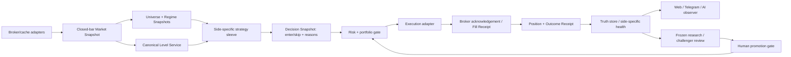

# Architecture Parity and Money Path — 2026-07-11

## Technical summary

Проект уже содержит большую часть нужных механизмов, но пока не является единой торговой станцией. Главный разрыв — не отсутствие ещё одного индикатора, а отсутствие обязательного сквозного контракта: один и тот же закрытый market snapshot, набор уровней, regime/universe decision, side-specific sleeve ID, execution plan и outcome receipt должны воспроизводиться в research, backtest, shadow, live, web, Telegram и AI.

Сейчас allocator, regime, universe selector, AI, levels, execution и reporting существуют, но все семь подсистем подключены частично и по-разному в разных режимах. Особенно критичны пять несовместимых level families и смешение «код существует» с «код управляет live решением». Переписывать проект целиком не нужно; нужно закрепить узкую раму вокруг уже работающих компонентов и переносить в неё по одному рукаву.

Денежный путь на snapshot остаётся узким:

- Bybit: один tiny money sleeve `ATT1 short-only`, risk `0.10`; конфигурация выровнена, edge не доказан;
- Alpaca: реальные позиции защищены stops `4/4`, но контур в SAFE-HOLD из-за live/research rotation и exit mismatch;
- frequent crypto: frozen risk-zero queue валидна, но все три sleeves получили `NO_PROMOTION`;
- FX/CFD: V3-код готов к диагностике, но performance заблокирован данными/news/cost calibration;
- AI: наблюдает, объясняет и предлагает; он не получает полномочий менять live risk.

Ни один календарный срок ниже не является обещанием прибыли. Дата может открыть следующий gate, но не заменить PASS.

## Scope и правила чтения карты

Snapshot опирается на direct runtime checks и Git/artifacts этой сессии до запуска документационного commit:

- `f459e9f` — fail-closed runtime parameter overlays;
- `ba53710` — fail-closed FX/CFD V3 branch;
- `a625a8b` — side-specific frequent-crypto preregistration;
- `4de548b` — разделение report-process order mode и scheduled position management truth;
- `115d032` — сохранение source mtime и atomic replace в live-mirror sync;
- VPS targeted deployment checks 11:13–11:22 UTC;
- `reports/FREQUENT_CRYPTO_AUDIT_PREREG_2026_07_11.md` и immutable output `20260711_112429`;
- `reports/research/fx_v3_preflight_20260711/preflight.json`.

Термины:

- **exists** — файл/класс/скрипт присутствует;
- **wired** — production или research entrypoint реально вызывает его;
- **parity** — одинаковые данные, clock, параметры и semantics дают воспроизводимое решение;
- **money sleeve** — может отправить ненулевой риск;
- **shadow** — исполняет полный decision path с risk `0` и без broker order.

## Денежная правда на checkpoint

| Контур | Что доказано | Что не доказано | Текущее действие |
|---|---|---|---|
| Bybit ATT1 | short-only, risk `0.10`, RSI `45`, expiry `2026-07-20`, contract hash `fd8048f…`; direct broker flat на deploy checks | положительный live edge, достаточный N, преимущество текущей trendline geometry | оставить tiny canary; не увеличивать risk/frequency |
| Alpaca LIVE | equity `$486.93`, `ABBV/ABNB/GE/SCHW`, simple broker DAY stops `4/4`, SAFE-HOLD | monthly rotation parity, fractional trailing parity, надёжная live expectancy | не открывать новые позиции до exact replay и ledger repair |
| Frequent crypto | frozen side-specific data/cost/gate contract; `15/15` cases COMPLETE, integrity PASS | положительный edge: ARS1 long/short ADX25 и ASB2 no-descending все провалили gates | `3/3 NO_PROMOTION`; не строить adapters и не тюнить threshold на этом окне |
| FX/CFD V3 | три причинные families, стороны разделены, code/config hashes сохранены | promotion-grade data, historical news, OANDA costs, любой PnL edge | `DATA_DIAGNOSTICS_ONLY`; не запускать demo/live |

## Матрица wiring и parity

| Технология | Research/backtest | Live/runtime | Web/TG/AI | Вердикт |
|---|---|---|---|---|
| Data + clock | Есть cache gates, completed HTF visibility и next-open в новых prereg runs; старые runs неоднородны | У разных wrappers разные fetch adapters; часть legacy путей может видеть forming candle | Отображается уже принятое решение, но не единый source-bars hash | **PARTIAL**: нужен canonical closed-bar Market Snapshot |
| Universe / подбор монет | Новая queue фиксирует universe по data quality до outcomes; отдельные OOS selectors существуют | Dynamic allowlists реально hot-reload symbols, теперь fail-closed для strategy params | AI видит allowlists/freshness, но не доказывает совпадение с research cohort | **PARTIAL**: один Universe Snapshot/hash на решение |
| Regime | Есть shared и strategy-local detectors; FX/crypto runs подключают их неодинаково | Approved baseline держит `REGIME_OVERLAY_ENABLE=0`; отдельные strategy gates остаются | Regime может показываться как context без доказательства, что он блокировал entry | **PARTIAL**: versioned Regime Snapshot и явный veto/weight receipt |
| Levels | Research использует несколько horizontal/sloped/liquidity механизмов; ATT1 имеет собственную geometry | Нет обязательного Level Service для всех live sleeves | Renderer и AI могут рисовать/объяснять не тот набор, который породил signal | **PARTIAL / HIGH RISK**: пять несовместимых families |
| Side split | Новые prereg и FX V3 физически разделяют long/short; `sleeve_registry` поддерживает атомарные sides | Monolith исторически использует strategy flags и не имеет обязательного registry path для всех sleeves | Отчётность может агрегировать family, если нет canonical sleeve ID | **PARTIAL**: side-specific ID обязателен от signal до PnL |
| Allocator / control plane | Allocator, OOS selector, champion/challenger и edge tools существуют | Approved baseline: `PORTFOLIO_ALLOCATOR_ENABLE=0`; `sleeve_registry` не является общим monolith owner | Web controls proposal-only; runtime acknowledgement общего control path отсутствует | **PARTIAL / FAIL-CLOSED**: сначала shadow registry, потом authority |
| Execution / risk | Новые runs фиксируют next-open, base/stress costs и side purity | Реальный Bybit order/stop/runner/breaker path есть; adapters различаются по стратегии | Heartbeat показывает effective ATT1, но universal Decision→Fill receipt отсутствует | **PARTIAL**: canonical plan + broker acknowledgement + outcome |
| AI operator | Может анализировать saved outcomes и challengers | Freshness-aware context deployed; `control_recommendations_allowed` блокируется при stale/conflict | Web/TG стали truth-first, AI control остаётся proposal-only | **OBSERVABILITY ONLY**: не auto-optimizer live risk |
| Reporting | Research outputs и prereg artifacts сохраняются, но форматы неоднородны | Broker truth, Alpaca reports/watchdog, `4de548b` и atomic/mtime-safe mirror `115d032` deployed и SHA-verified | Web `/ping` PASS, manual TG delivery PASS; auth replay и first scheduled delivery ещё не доказаны | **PARTIAL**: Operator Truth Snapshot + delivery receipts |

### Что действительно участвует в live, а что пока библиотека

Доказанный live-real path включает monolith `smart_pump_reversal_bot.py`, ATT1 strategy/config, broker order/stop/runner/breaker, heartbeat, fail-closed allowlist watcher, AI context, web/TG reporting и Alpaca bridge в SAFE-HOLD.

Следующие важные модули существуют, но не являются единым обязательным production path:

- `bot/unified_levels.py` не импортируется monolith как общий source уровней;
- `bot/sleeve_registry.py` не владеет всеми live strategy×side lifecycle;
- portfolio allocator и regime overlay выключены в approved baseline;
- `bot/att1_live_wiring.py` подключён, но Decision Bus / edge monitor флаги default OFF и alert-only;
- OOS selector, champion/challenger и research orchestrator применяются в исследованиях, а не как автоматическое разрешение money risk;
- web trading mutations proposal-only, потому что нет подтверждённого live consumer + acknowledgement.

Это не повод удалить библиотеки. Это означает, что они должны входить в раму только после parity test, а не считаться работающими «по факту наличия».

## Пять несовместимых level families

Аудит насчитал пять практически разных источников/семантик уровней:

1. **ATT1 private trendline geometry** — sloped line из собственных pivots; не потребляет общий LevelSet.
2. **Legacy strategy-local extrema/range levels** — prior-window highs/lows, Bollinger boundaries или локальные support/resistance в конкретной стратегии.
3. **`bot.market_context`** — horizontal clusters, pivots, channel/sloped geometry, HVN и базовые market features.
4. **`bot.unified_levels`** — агрегатор horizontal/sloped/HVN/flip/liquidity/round поверх `market_context`, но не общий live contract.
5. **`bot.level_memory` + liquidity/sweep family** — respect/reaction history и отдельные event semantics, используемые главным образом в research/FX branches.

Проблема не в том, что методов пять. Проблема в отсутствии общей идентичности уровня: один и тот же level не имеет обязательных `level_id`, `created_at`, `valid_at`, history, source-bars hash и projection timestamp во всех режимах. Поэтому backtest может торговать один level, web рисовать похожий, а AI объяснять третий.

Целевой Level Snapshot обязан содержать:

- `level_id`, `kind`, `side`, `price_at_valid_at`, `projection_rule`;
- confirmed pivot IDs и только фактические touches/respects;
- `created_at`, `valid_at`, `broken_at`, `invalidated_at`;
- age, distance ATR, quality, first-retouch state;
- `market_snapshot_sha`, `level_service_version`, `source_bars_sha`;
- одинаковую сериализацию/hash для backtest, live, chart и explanation.

## Целевая рама

Главное ограничение: обратная связь из AI/research не пишет live параметры напрямую. Она создаёт immutable proposal с evidence hashes; human-reviewed promotion переводит конкретный `strategy×version×side` между `candidate → shadow → canary → champion/demoted`.

## Обязательные canonical snapshots и receipts

### 1. Market Snapshot

Один immutable объект на `market/symbol/timeframe/decision_ts`:

- только закрытые bars и точная граница доступности;
- source, coverage, gaps, timezone/session;
- bars SHA-256 и data-quality verdict;
- cost/news artifact hashes там, где они влияют на решение.

### 2. Universe и Regime Snapshots

Universe фиксирует полный список eligible/excluded symbols и причины до просмотра outcomes. Regime фиксирует detector version, inputs, probabilities/state и действие `allow/veto/weight`, а не просто label для отчёта.

### 3. Level Snapshot

Создаётся из Market Snapshot и является единственным источником geometry для strategy, chart и AI. Strategy может выбрать subset уровней, но обязана сохранить выбранные `level_id` и причины отказа от остальных.

### 4. Decision Snapshot

Минимальные поля:

- immutable `decision_id`;
- canonical `sleeve_id`, например `crypto.ars1.v1.long` или `fx.horizontal_range_rejection.v3.short`;
- strategy code/config SHA, market/universe/regime/level hashes;
- `enter` или `skip`, reason codes, planned entry/stop/targets/expiry;
- requested risk до и после portfolio gate;
- clock semantics: signal close и earliest legal fill.

### 5. Execution и Outcome Receipts

Execution Receipt связывает `decision_id` с request, exchange acknowledgement, fills, rejection, fees/slippage и broker stop acknowledgement. Outcome Receipt хранит exit reason, realized PnL/R, costs, MFE/MAE, duration и censor/data flags. Потеря post-entry candles не превращается в ноль: outcome становится `DATA_INVALID` и блокирует promotion.

### 6. Operator Truth Snapshot

Отдельный read-only snapshot объединяет:

- local/origin/VPS Git refs и deployed manifest SHA;
- service PID/start time, heartbeat freshness и effective config hashes;
- direct broker positions/stops и money sleeves;
- report/AI/web freshness и delivery receipts;
- blockers, expiry и rollback backup.

Web, TG и AI читают этот snapshot. Proposal control считается применённым только после нового runtime acknowledgement с effective hash.

## Long-only и short-only — физическая единица управления

Общий strategy class допустим, но ниже signal generation стороны никогда не смешиваются. Для каждой стороны отдельно нужны:

- `sleeve_id` и config hash;
- research rows и promotion verdict;
- breaker, risk, allocation и lifecycle stage;
- expectancy/PF/DD, folds/holdout/breadth/concentration;
- shadow/live outcomes и demotion.

Bidirectional aggregate может использоваться только как портфельный обзор. Он не разрешает live, если одна сторона провалила gate. Это уже соблюдается в frequent-crypto prereg и FX V3; целевая рама должна сделать правило обязательным для всех sleeves.

## Текущие очереди: что считать результатом

### Frequent crypto

Frozen queue в `a625a8b` проверяет только:

- ARS1 long-only и short-only: `ADX off → ADX <=25`;
- ASB2 long-only: `ALLOW_DESCENDING 1 → 0`.

Canonical run вышел из screen `93788.frequent_crypto_prereg_20260711`: output `reports/research/frequent_crypto_prereg_20260711/20260711_112429/`, frozen code head `f459e9f`, `15` cases, risk-zero/no broker. Integrity PASS, но performance verdict `3/3 NO_PROMOTION`: ARS1 long ADX25 PF `0.374/0.292/0.821`, ARS1 short `0.682/0.550/0.514`, ASB2 no-descending `0.754/0.524/0.639` для annual base/stress/fresh-90d stress. `111740` и `111943` исключены навсегда. Полный gate audit: `reports/FREQUENT_CRYPTO_VERDICT_2026_07_11.md`.

Следствие: ARS1/ASB2 adapters не строятся, threshold-grid на том же окне запрещён. Следующий frequent challenger должен иметь новую event-first механику и persisted state, а не быть post-hoc ремонтом этих результатов.

### FX/CFD V3

Commit `ba53710` заморозил три hypotheses до outcomes. Preflight status `DATA_DIAGNOSTICS_ONLY` и `performance_research_allowed=false` из-за трёх blockers:

1. strict promotion data gate failed;
2. historical news calendar missing/unpinned;
3. target-broker cost calibration missing/unpinned.

Поэтому текущий V3 artifact доказывает fail-closed механику, а не доходность. Любые числа PnL до устранения blockers не должны появляться в карте.

## Promotion gates и денежный путь

| Stage | Минимальное доказательство | Что разрешено | Ориентир времени, если предыдущий gate PASS |
|---|---|---|---|
| 0. Runtime truth | flat-window deploy, manifest/backup, effective hashes, broker truth, rollback | существующий risk без увеличения | часы / 1 сессия |
| 1. Data eligibility | coverage/gaps/closed bars, costs, news/calendar where needed, frozen universe | diagnostic research | 1–3 сессии; FX может занять дольше из-за внешних данных |
| 2. Frozen causal research | source/config hashes, next-open, base+stress, sides separate, folds/holdout/breadth/concentration | `NO_PROMOTION` или `RESEARCH_PASS_ONLY` | часы–3 дня на одну bounded suite |
| 3. Class/execution parity | тот же snapshot/strategy semantics, closed-bar adapter, exact replay, Decision/Execution receipts | risk-zero shadow | обычно 3–7 дней инженерной работы на один sleeve |
| 4. Shadow/demo evidence | стабильный runtime, no missing outcomes, минимум `30` clean closes, side-specific health | tiny canary review | обычно 2–8+ недель в зависимости от частоты |
| 5. Tiny canary | broker stops, kill switch, clean fills, DD/edge within prereg bounds | маленький ненулевой risk | ещё 6–12 недель meaningful history; не автоматический scale |
| 6. Portfolio scale | несколько независимых sleeves, clean live months, bounded correlation/DD, capital plan | постепенное увеличение risk | месяцы, только evidence-driven |

### Ближайший практический путь по контурам

1. **ATT1:** только наблюдать tiny canary и накапливать чистые outcomes; не лечить winrate ослаблением фильтров. Новый geometry/meta-gate — отдельный challenger.
2. **Alpaca:** восстановить ledger, сравнить exact monthly/daily/adaptive с одной exit model и подтвердить fractional trailing implementation. SAFE-HOLD остаётся до monthly-boundary decision.
3. **Frequent crypto:** verdict уже отрицательный; не строить ARS1/ASB2 live adapters и не заменять FAIL новой сеткой. Выбрать один event-first persisted challenger.
4. **FX/CFD:** сначала данные/news/OANDA cost artifact, потом V3 performance, потом demo. Пополнение капитала до этого не имеет доказательной основы.
5. **Level Service:** внедрять вертикальным slice на одном challenger: Market→Level→Decision→chart/AI hash equality. После этого переносить другие strategies.

## Ограничения и robustness checks

- Точный ATT1 contract/hash повторно проверен read-only после watcher restart: direct broker positions `0`, short-only, risk `0.10`, RSI `45`, expiry `2026-07-20`, hash `fd8048f7…`.
- VPS Git HEAD остаётся `f7ed011` и не отражает targeted deployed files. До нормализации release manifest важнее server `git rev-parse` для runtime truth.
- Implementation checkpoint `115d032` pushed; `4de548b` и `115d032` адресно deployed и SHA-verified. Current documentation HEAD надо получать отдельно. VPS Git checkout всё ещё `f7ed011` dirty.
- Web `/ping` и service health не доказывают password/TOTP flow; auth login надо replay отдельно.
- Manual TG delivery доказана; первый automatic post-close delivery ожидается 13 июля и пока не доказан.
- Alpaca 70%-scaled CAGR `15.64–17.60%` и 12m OOS около `19.08%` — арифметическое масштабирование исследовательских curves до costs/gaps/tax, не live forecast. Exit parity FAIL.
- Частота «несколько сделок в день» не является gate. Если после costs positive edge требует меньше сделок, система должна выбрать edge, а не целевую активность.
- AI может сократить анализ и найти drift, но не создаёт edge сам по себе и не должен оптимизировать live по малому N.

## Следующие вопросы, которые могут изменить решение

1. Какая новая event-first frequent механика имеет независимое основание после отказа ARS1/ASB2, не используя тот же outcome для tuning?
2. Можно ли воспроизвести Alpaca live fills/rotation/exits exact replay без damaged ledger и exit mismatch?
3. Какие FX symbols станут promotion-grade после fresh M5 и off-schedule gap audit?
4. Доступны ли timestamped historical macro-news и OANDA cost observations с достаточным покрытием для hash-pinned artifact?
5. Какой один challenger первым получит end-to-end canonical Level/Decision/Execution snapshots без параллельного изменения стратегии?

До ответа на эти вопросы правильный результат — не «включить больше всего», а сохранить один безопасный money path, доказать правду каждого решения и продвигать только независимую сторону, прошедшую все ворота.
