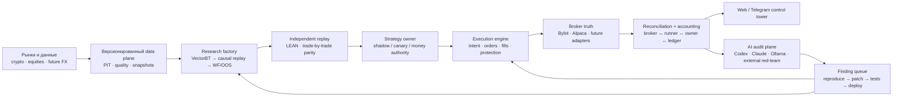
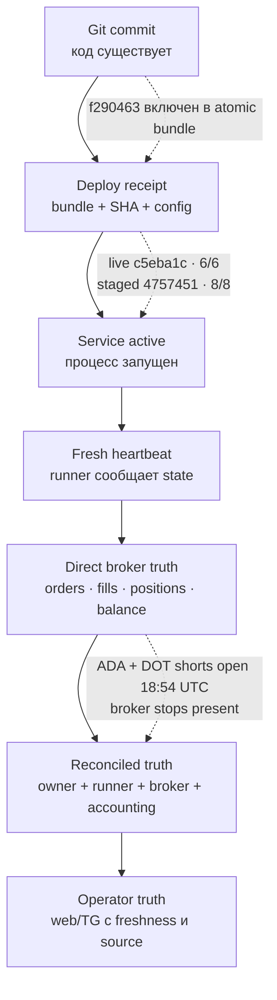
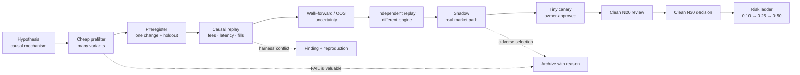
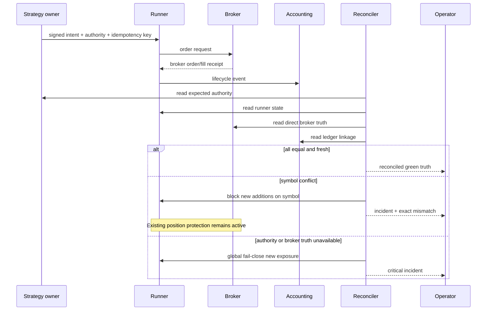
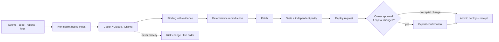

# Визуальная карта торговой станции

Срез: 2026-08-10 18:55 UTC. Сплошные смысловые связи — целевая архитектура; статусы live
следует читать только вместе со временем и источником.

## 1. Какой это проект

## 2. Truth ladder для live

Нижний слой не может быть доказан верхним: active service не доказывает flat,
heartbeat не доказывает broker balance, а Git commit не доказывает deploy.

## 3. Promotion funnel

## 4. Текущая карта контуров

```mermaid
flowchart TB
    subgraph Money["Money authority"]
        ATT["ATT1 short-only · risk 0.10<br/>ADA + DOT execution incidents<br/>pause new entries required"]
    end

    subgraph RiskZero["Risk-zero / shadow"]
        B1["BOUNCE1 / IVB1 / midterm<br/>enabled, risk 0"]
        MK["Maker entry<br/>adverse-selection conflict"]
        RT["Retest3<br/>config contract repaired<br/>edge not proven"]
        SB["Sloped break/retest<br/>ms/sec fix tested<br/>reachability open"]
        FU["Funding dynamic/frozen<br/>capital_authorized=false"]
        XS["XSEC v3<br/>median negative; outlier-dominated"]
        AP["Alpaca adaptive<br/>shadow_no_orders"]
        LG["Long-leg program<br/>largest portfolio gap"]
        SD["Six-day research queue<br/>48 bounded cases<br/>no order authority"]
    end

    subgraph SafeHold["Protected but not promotion-ready"]
        AL["Alpaca ABBV + SCHW<br/>equity $485.87 · stops 2/2<br/>SAFE_HOLD"]
    end

    ATT --> REC["Reconciliation gate<br/>pure four-source contract tested<br/>live wiring open"]
    B1 --> REP["Independent replay"]
    MK --> REP
    RT --> REP
    SB --> REP
    FU --> REP
    XS --> REP
    AP --> REP
    LG --> REP
    SD --> REP
    AL --> MKT["Protective apply PASS<br/>SCHW stop 96.47 → 105.03<br/>DAY rearm proof remains"]
```

## 5. Целевая fail-close логика

## 6. Human/AI boundary

