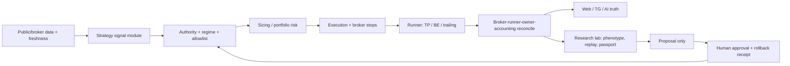

# Состояние станции и ускоренный план — 13 августа 2026

Cutoff: 2026-08-13 14:25 UTC. Это evidence-backed срез, а не обещание
доходности. Все новые исследования были public/read-only, без broker/order/risk
authority.

## Дополнение большой сессии — 14:25 UTC

### Что реально изменилось

1. Последняя BTC ATT1 закрылась по биржевому stop: fill `63560.8`, close
   `63827.2`, net `-0.3364634 USDT` или `-1.288638R` после комиссии. Runner
   TP/BE/trailing был включён, но не активировался: цена не дошла до `1R`.
   Actual fill был лучше requested price для short; это не latency/chasing bug.
2. Найден геометрический failure mode сигнала: pivot highs
   `64477 -> 63690 -> 63994.4`. Линейная регрессия осталась наклонена вниз из-за
   первого высокого anchor, хотя последний high вырос. Поэтому пользовательская
   характеристика «ступенька, а не чистая наклонная» подтверждается числами.
3. Frozen pre-holdout ATT1 pivot-sequence challenger на восьми major symbols:
   baseline `538` сделок, `-17.916439R`; challenger `393`, `-2.467991R`.
   Убыток резко уменьшен, результат лучше на `6/8` символах, retention `73.0%`,
   independent audit PASS. Но `-0.00628R/trade` всё ещё не положительный edge:
   это подтверждённый ремонт классификации, а не новая money-нога.
4. Clean ATT1 cohort после release пересчитан из broker/runner events:
   `2/20`, DOT `+1.264741R`, BTC `-1.288638R`, итого `-0.023897R`, PF `0.981`.
   Gate `0.10 -> 0.25` не пройден. Неизменные условия: exact parity, N20,
   net `>=+2R`, PF `>=1.20`, DD `<=5R`, zero unresolved conflicts.
5. Alpaca protection challenger дал заметный механизм. Текущий proxy:
   `11.14%` annual / DD `23.71%`. Entry-relative stop: `25.65%` / DD `14.36%`;
   тот же вариант в stress: `24.87%` / DD `14.43%`. Entry-stop + gap guard 2%:
   `23.69%` / DD `9.21%`, но только `29` trades и поэтому prereg gate FAIL
   (`N>=30`). Independent audit PASS, capital authority false. Следующий шаг —
   отдельная validation/PIT/live-manager parity, а не немедленная смена live.
6. Direct GET-only Alpaca truth: account LIVE/ACTIVE, equity `$487.38`, cash
   `$391.27`; ABBV и SCHW защищены broker stops. SCHW stop уже поднят до
   `106.13` при entry `101.552`, то есть контур действительно фиксирует часть
   прибыли. ABBV ещё не достиг activation threshold.
7. Inplay supervisor исправлен на single-instance `fcntl` lock. Дублирующиеся
   research-only loops остановлены после диагностики; один collector работает,
   второй запуск fail-closes. Prospective sample пока `N=0`.
8. Для XAUUSD запущен resumable public-only Dukascopy M5 backfill
   `2021-01-01 .. 2025-10-01` с month chunks, SHA receipt, `20 GiB` disk guard
   и жёсткой границей sealed holdout. Процесс активен, первый chunk ещё не
   завершён; интерпретации до receipt нет.
9. Web password reset utility размещён на VPS и сверён SHA-256
   `a61f519a6c0a21b8de46dfe62cc5664ea40bea0052057e8f4e649dc06ef572f8`.
   Пароль вводится только скрыто в локальном Terminal; TOTP/роль сохраняются,
   сервис не рестартует. Server config обновлён после запуска utility: один
   enabled admin, TOTP/password hash присутствуют, mode `0600`; server-side
   reset `COMPLETE`. Остался пользовательский login smoke новым паролем и
   существующим Authenticator code.
10. График сделки теперь различает `signal TF` и `execution 5m`, а reason
    сериализует `tf=...`. Старые reason без TF получают явно помеченный config
    fallback. Исправление локально проверено, но live monolith не деплоился.

### Исторические тесты не запрещены

Запрета нет. Запрещены только несопоставимые цифры: чтение sealed holdout,
same-bar execution, скрытая смена universe, отсутствие реальных издержек и
подгонка после просмотра результата. Рабочий конвейер остаётся быстрым:
`prereg -> passport -> causal replay -> cost stress -> independent audit ->
prospective shadow`. В этой сессии через него уже прошли ATT1 и Alpaca; XAU
получает более длинную историю.

### Следующие fixed исследования

- ATT1: отдельное frozen validation pivot-sequence, затем observe-only parity;
- Alpaca: PIT/sector/corporate-action/live-manager parity для entry-relative
  stop, затем независимое окно; gap 2% остаётся отдельным challenger;
- XAU: после data receipt — session breakout/retest V3, затем отдельно
  sweep/reclaim, first-correction и causal sloped break/retest;
- liquid crypto: BTC/ETH H4/D1 trend-pullback и support-reclaim как отдельные
  long families, не копия отвергнутого BTC Inplay;
- legacy batch: sweep-reclaim, sloped-retest и L2-density, максимум один fixed
  механизм на вариант.

Focused suite: `58 passed`; `git diff --check` PASS. Тематические receipts:
`2a7ea8c` (private web password reset), `757049c` (ATT1 geometry/chart/audit),
`f0e9cae` (Alpaca/Inplay/XAU lanes). Live orders, risk и monolith в этой
сессии не изменялись.

Post-push live recheck: broker `retCode=0`, positions `0`; `bybot.service` и
`trading-journal-web.service` active; heartbeat age `6.5s`, `trade_on=true`,
`dry_run=false`, `open_trades=0`, `bear_chop`, `ws_guard_active=0`.

## Решение одним абзацем

Бот не офлайн: Bybit core активен, flat подтверждён прямым broker API, WS guard
снят, ATT1 остаётся единственной tiny money-ногой. Проект сделал широкий шаг в
качестве решений: за одну сессию funding прошёл exact mapping и реальные
комиссии, Alpaca получила clean-962 proxy, SOL-pocket проверен на режимы,
Inplay перенесён на BTC, золото получило intraday-flat baseline, а AI и position
checker перестали выдавать ложную операционную истину. Денежного прорыва пока
нет: новая готовая live-нога не появилась. Зато теперь видны три конкретных
кандидата вместо десятков неразличимых обещаний: Inplay ETH prospective, Alpaca
stop/gap challenger и XAU session breakout/retest.

## Прямая операционная истина

| Слой | Факт | Вердикт |
|---|---|---|
| VPS service | `active/running` | ONLINE |
| Heartbeat | fresh; `trade_on=true`, `dry_run=false`, `open_trades=0`, `bybit_msgs=9,999,319` | ONLINE |
| WS guard | `ws_guard_active=0` | OK |
| Broker | `retCode=0`, positions `0` | FLAT, один прямой check |
| Money authority | только ATT1 short `risk_mult=0.10` | не расширена |
| Research | local station `6/6 healthy` | proposal/risk-zero |
| Диск | 94 GiB free; local collectors inside guards | OK |

Локальный position checker имел истёкший ключ и выводил ноль рядом с API
ошибкой. Его контракт исправлен: при `retCode != 0` состояние только
`NOT_CONFIRMED`, count/positions равны `null`. Серверный checker с действующим
секретом отдельно подтвердил flat. Один check не заменяет тройной flat-gate для
deploy.

## Пять прямых ответов

### 1. Частота Inplay и N30

Четыре неперекрывающихся исторических окна по 40,000 пятиминутных баров дали
`84, 77, 156, 118` сигналов: всего `435` примерно за `556` дней, или `0.782` в
день. Механическая оценка N30 — `38.3 дня`, `5.47 недели`; диапазон по окнам
`3.8–7.7 недели`. Prospective ETH после первых ~18 часов всё ещё `N=0`, что
статистически не необычно. Одна из четырёх исторических частей отрицательна,
поэтому N10 может подтвердить только корректность исполнения, не edge.

### 2. Funding после spot/perp mapping и spot 10/10 bps

Да, положительная разница исторически сохраняется, но экономика слишком тонкая
для live:

| Сценарий | Pair-notional annualized | Gross two-leg capital | Красные периоды |
|---|---:|---:|---:|
| base: spot 20 + perp 11 bps round trip | 7.53% | 3.77% | 5/31 |
| stress: 51 bps round trip | 5.10% | 2.55% | 8/31 |

После parity gate осталось 74 exact-mapped пары, 16 symbol-periods помещены в
карантин; первоначальная V1 поймала грубый price-scale mismatch ZEC. Selection
edge `+2.03%`, но по половинам `+4.03%` и `+0.15%`, survivor/PIT не закрыт, а
текущий forward N4 сильно отрицательный. Вердикт: диагностический survival,
не money-leg.

### 3. Alpaca clean subset base/stress с live-contract proxy

| Метрика | Base 5 bps/side | Stress 10 bps/side |
|---|---:|---:|
| total, 2 года | +23.48% | +21.86% |
| annualized | +11.14% | +10.41% |
| max drawdown | 23.71% | 23.80% |
| profit factor | 1.270 | 1.249 |
| trades / red months | 40 / 8 из 25 | 40 / 8 из 25 |
| average exposure | 10.24% | 10.24% |

Это полезный положительный proxy, но ещё не exact live-contract. У `40/43`
выбранных слотов (`93%`) отсутствует sector mapping; current-sector lookup не
является PIT. Стоп от signal-close при next-open fill создал gap losses до
`-22..-28%`. Следующий falsifiable test: полный sector/PIT mapping плюс
entry-relative stop и запрет входа при чрезмерном overnight gap. Только после
него сравнивать стратегию с пассивным ETF. Порог `+5%` — не цель доходности, а
лишь минимальный sanity floor; при DD 24% даже 10–11% пока не выглядит
достаточно сильным.

### 4. Объясняет ли режим положительность SOL в RMR1

Нет. SOL имеет `N=70`, PF `1.244`, `+0.160R/trade`, но t-stat всего `0.944`.
После regime split классифицирована 51 сделка: первая половина `+0.525R`,
вторая `+0.057R`; ни один заранее определённый режим с N>=10 не положителен в
обеих половинах. До нового независимого объясняющего признака это luck/unknown
factor, не отдельная нога.

### 5. Следующий legacy batch с максимумом информации на время

1. `Alpaca stop/gap + sector completion` — влияет на уже защищённый реальный
   контур и проверяет конкретный обнаруженный failure mode.
2. `XAU session breakout/retest` — расширить историю и проверить на новом
   broker-realistic spread contract; два других XAU-семейства уже отсеяны.
3. `sweep_reclaim + sloped_break_retest + l2_density_edge` — по одному
   фиксированному causal reproduction, потому что они используют уже
   накопленные level/L2 данные и могут дать независимую механику.
4. `range_mean_reversion_v1` — воспроизвести SOL pocket только с frozen regime
   hypothesis; без parameter sweep.
5. `audit_backtest_run + trial_ledger` — не ноги, но повышают скорость и
   достоверность всех следующих batch.

Не брать сейчас `smart_grid`, старые XSEC варианты и MPL: их последние exact
контракты уже дали достаточно отрицательной информации.

## Готовность контуров и реальные сроки

Срок — до следующего проверяемого gate при непрерывной работе, не до прибыли.

| Контур | Сейчас | До research-ready | До tiny-money при PASS | Интеграция с основой |
|---|---|---:|---:|---|
| ATT1 | live tiny, clean cohort 1/20 | parity/reconciliation 2–3 раб. дня | N20 около конца сентября при текущей частоте | высокая; общий runner/stops/TG, но cohort/accounting loop не закрыт |
| Inplay ETH | prospective N0, ~0.78 signal/day historically | N10 ~2 недели; N30 ~5.5 недели | не раньше N10 implementation gate; expectancy review N30 | средняя; adapter есть, monolith authority отсутствует намеренно |
| Funding/carry | exact diagnostic survives weakly; forward N4 negative | PIT/listings/fees/LOSO 1–2 недели | 3–6 недель только при развороте forward экономики | средняя; research engine есть, two-leg execution/reconcile нет |
| Alpaca | SAFE_HOLD/protected pilot; clean proxy positive but flawed | 3–7 раб. дней | selection micro-canary ещё 2–4 недели при PASS | средне-высокая; broker stops есть, exact selection/parity нет |
| XAUUSD | flat harness готов; 1 thin positive candidate | 2–4 дня на long history/cost contract | demo 2 недели, tiny money ориентир 3–5 недель при PASS | средняя; FX harness есть, broker adapter/news/spread truth нет |
| BTC/ETH long | BTC port of Inplay rejected | 3–5 дней на одну отдельную fixed family | после stable folds + shadow, не по календарю | средняя; данные/adapter есть, edge нет |
| XSEC | causal V1 rejected under stress | только новый mechanism/PIT, не tuning | нет текущего money ETA | shadow process высокий, economic evidence низкий |
| DeFi/yield | inventory only | read-only rate/risk radar 2–4 дня | auto-move не планировать до security/economics audit | низкая; отдельный custody/security contour |

Первый XAU materialization V1 был снят до интерпретации: он фильтровал output
по cutoff, но затем продолжал проходить смешанный source и вычислял полный хэш.
V2 останавливается на первой boundary timestamp, не использует outcome-поля
после cutoff и имеет отдельный write-once passport. Invalid V1 сохранён вне
worktree в `/private/tmp/bybot_invalid_xau_v1_20260813/` для форензики.

## Как основа взаимодействует со стратегиями

Грубая WIP-оценка зрелости: live core/guards `70–75%`, research integrity
`75–80%`, data layer `65–70%`, Alpaca contour `45–50%`, AI operator `50–55%`,
FX/multi-market adapter `35–45%`, диверсифицированная crypto book `25–30%`.
До owner-defined MVP (3–4 crypto legs + полноценная Alpaca) пройдено примерно
`45%`; до автономной multi-market станции с AI approval loop — `25–30%`.

## Ускорение без ложной скорости

Принимается трёхпоточная модель ресурсов:

- 60% — Inplay ETH, Alpaca exact challenger, XAU positive candidate;
- 25% — еженедельный fixed batch из 3–5 legacy-кандидатов;
- 15% — ATT1 parity/reconciliation, ключи, TG/Web/AI truth и зачистка.

Не принимается включение Inplay/carry в реальные деньги сегодня. Причина не
перфекционизм: Inplay имеет prospective N0 и отрицательный fold, BTC portability
провалилась; carry имеет отрицательный forward N4 и лишь 2.55–3.77% historical
gross-capital economics. Живые деньги не ускоряют накопление сигнала: zero-risk
collector уже записывает signal timestamp, next executable bar, MFE/MAE и
costs. Money нужен только для проверки execution slippage после механической
паритетности.

Ускоренный tiny-canary gate:

1. fixed base и stress положительны, independent audit PASS;
2. backtest/live order parity PASS;
3. prospective N10 без implementation conflicts;
4. broker stop/kill switch/reconciliation готовы;
5. owner отдельно одобряет микрориск; N10 не считается доказательством edge.

## Ликвидные активы и бычий рынок

- BTC/ETH — обязательный отдельный long lane, но не копия rejected Inplay BTC.
  Следующие fixed families: daily/H4 trend pullback, volatility expansion после
  squeeze и support-reclaim с BTC/ETH-specific costs. Long/short — независимые
  legs, не switch по прогнозу «буллран через год».
- XAUUSD — intraday-only контракт реализован в harness. Из приложенного списка
  первый baseline уже отверг generic trend pullback и round-level sweep, но
  оставил session breakout/retest. Следующая версия умного индикатора должна
  выдавать не «long/short по EMA», а probability card: slope/approach speed,
  session range compression, distance to level, realized volatility и
  macro/news blackout. COT/DXY/rates — отдельные prereg challengers, не смесь.
- Информационный фон полезен прежде всего как event-risk/blackout и regime
  feature. Генеративный пересказ новостей не получает права менять позицию.

## AI-генератор идей

Стык создан: market scanner принимает компактный public-source digest, а
`research_lab/idea_intake.py` пропускает только идеи с mechanism, data contract,
costs, fixed test и death criterion. Дубликаты сверяются с hypothesis memory.
Все внешние тексты untrusted; AI не читает secrets, не запускает эксперименты и
не имеет capital authority. Следующий безопасный шаг — allowlisted RSS/API
collector (papers, exchange specs, CFTC/CME/official docs) и очередь
`idea -> prereg -> passport -> reproduction -> independent audit -> shadow`.

## Зачистка 500+ файлов

Радикально удалять нельзя. Уже проинвентаризировано 166 code-кандидатов:
117 evidence-backed/reproduction, 16 referenced-review, 6 test-backed, 27
quarantine. Правило:

1. reference/import map;
2. exact reproduction не дольше 30 минут;
3. полезное — отдельный тематический commit;
4. невоспроизводимое — manifest в graveyard/quarantine;
5. физическое перемещение/удаление только после второго прохода.

Так рабочая ветка станет чистой без потери уровней, web-улучшений и research
инструментов Клода.

## API-ключи, copy trading и побочный доход

- Новые Alpaca/Massive keys дают безопасность и доказуемую изоляцию, не edge.
  Порядок: создать новые в кабинетах, сохранить только в secret store/server
  env, GET-only account/data smoke, затем отозвать старые. До признаков утечки
  защищённый pilot может продолжать работать на старых, но rotation остаётся P0
  hygiene.
- Copy trading ATT1 сейчас не создавать/не рекламировать как продукт: clean
  live sample слишком мал. Позже — отдельный subaccount после N30+, измеренного
  DD и чистого performance receipt.
- Pine/TradingView: продавать можно только собственный проверенный инструмент,
  а не «92 внутренних модуля». Лучший кандидат на упаковку позже — level
  approach-speed/probability tool без обещаний доходности.
- Aave/AMM/yield можно алгоритмизировать сначала как read-only radar APY,
  liquidity, gas, lockup, depeg и smart-contract risk. Автоперекладка денег при
  капитале около $2k не является текущим приоритетом и не «почти безрискова».

## Следующие 72 часа

1. Alpaca V2: full sector map, PIT limitations, entry-relative stop/gap guard,
   base/stress и independent audit.
2. XAU V3: расширить pre-holdout историю; воспроизвести только session
   breakout/retest с account-specific spread stress, затем zero-risk shadow.
3. Legacy batch: sweep-reclaim, sloped-retest, L2-density — по одному frozen
   contract; не больше пяти кандидатов одновременно.
4. ATT1: завершить golden lifecycle parity и постоянный reconcile; clean N20
   продолжает накапливаться без повышения риска.
5. Inplay: не тюнить; выпускать weekly cadence card. Funding: ждать closed
   cycles, не интерпретировать N4.
6. VPS research-l2: storage guard сработал при 2 GiB. Не повышать cap; решить
   отдельным owner-approved retention/archive планом. Локальный сбор непрерывен.
7. Rotate Alpaca/Massive keys при первой авторизованной сессии пользователя.

## Определение финиша V1

- 3–4 независимые crypto legs: reproduced edge, stress, prospective, parity,
  tiny canary и отдельный kill switch;
- Alpaca exact live-contract selection с protected exits;
- broker-runner-owner-accounting reconcile по расписанию;
- Web/TG/AI показывают один freshness-aware truth;
- AI автономно предлагает и проверяет гипотезы, но деньги меняет только через
  human approval и rollback receipt;
- dirty worktree заменён индексом active/quarantine/archive.

Это большой оставшийся фронт. Мотивационный факт не в том, что «почти готово»,
а в том, что теперь один рабочий день способен честно закрыть несколько ложных
веток и оставить конкретную следующую ставку — сегодня это произошло пять раз.
