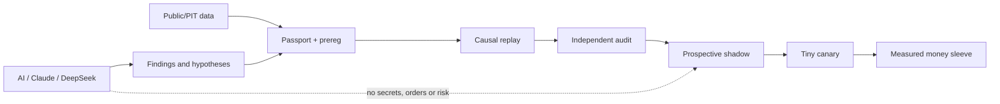

# Состояние торговой станции — 12 августа 2026

Срез доказательств: 11:55 UTC. Это ответ «что реально работает, что сыро и куда
двигаться», а не рекламный список модулей.

## Короткий вывод

Шаг вперёд широкий, но пока в основном в достоверности и пропускной способности
исследований. Денежный crypto-контур по-прежнему один: маленький ATT1 canary.
Alpaca — защищённый пилот с двумя существующими позициями, но не доказанная
стратегия отбора. Новая практическая надежда появилась у Inplay: исправленный
causal replay допускает prospective zero-risk shadow, и этот collector уже
запущен. MPL и причинный XSEC текущей формулировки честно отклонены.

Live Bybit напрямую подтверждён с сервера: `0` открытых позиций. Локальный
read-only ключ истёк (`retCode=33004`), поэтому локальный checker временно не
является источником истины; server checker вернул `retCode=0` и broker flat.
Live-код, ордера, риск и сервисы в этой сессии не менялись.

## Дополнение 11:55 UTC — что изменилось в этой рабочей сессии

1. **Alpaca LIVE truth восстановлен.** Direct CLI-checker теперь по умолчанию
   читает защищённый live-v38 env, явно печатает источник env и различает
   `LIVE/PAPER`. GET-only broker truth: счёт `ACTIVE`, equity `$485.91`, cash
   `$391.27`, позиции ABBV/SCHW, broker stops `2/2`.
2. **Найден откат защиты прибыли между сессиями.** SCHW stop был поднят до
   `105.32`, но имел `DAY`; после закрытия сессии он был отменён и восстановлен
   на исходном `96.47`. Для standalone fractional stops контракт и три configs
   исправлены на `GTC`. Исправление протестировано и запушено, но текущий
   брокерский ордер не менялся и серверный live не перезапускался.
3. **Alpaca PIT archive завершён:** `1000/1000`, download failures `0`.
   Валидатор нашёл `24` ticker-identity конфликта (бары после delist) и `14`
   пустых историй. Полный pool остаётся `FAIL_CLOSED`; `38` имён помещены в
   карантин, чистый research-only subset содержит `962` имени. Selection bias
   не снят, капитал и promotion не разрешены.
4. **Первая пачка грязного research-кода измерена.** TPB1 на ETH отклонён
   (`247` сделок, PF `0.828`, `-0.046R/сделку`). RMR1 на ETH был около нуля,
   поэтому автоматически получил wide-test; на восьми мажорах `733` сделки,
   PF `0.789`, `-0.209R/сделку` при `16 bps`, а при `8 bps` PF `0.892`,
   `-0.106R/сделку`. Универсальная версия отклонена; post-hoc выбор SOL не
   допускается как новая нога.
5. **Исследовательская непрерывность подтверждена.** Основной supervisor
   `6/6 healthy`, Inplay продолжает zero-risk сбор (`N=0` пока), funding
   dynamic/frozen имеют по три открытых shadow trials и ноль закрытых, alt24
   L2 накопил более `35k` наблюдений по `24` символам. Никакой контур не имеет
   новых ордерных или рисковых прав.

## Карта системы и ворота капитала

AI помогает искать дефекты, фенотипы убытков и гипотезы, но не может перескочить
ворота, включить стратегию или менять риск. Любая находка становится знанием
только после `finding → reproduction → patch → tests → receipt`.

## Контуры денег и исследований

| Контур | Текущий статус | Что измерено | Главный следующий gate |
|---|---|---|---|
| ATT1, 8 majors | `CANARY`, tiny risk | старый narrow anchor `308` сделок, `+0.098R/сделку`; wide 62-symbol `-0.035R/сделку` | clean post-fix N20, exact lifecycle reconciliation, net `>=+2R`, PF `>=1.20` |
| Inplay ETH 24h | `SHADOW`, zero risk | causal next-open `N=455`, 3/4 folds positive, median `+0.1705R`; один fold `-0.4602R` | prospective N30–50 без tuning; затем symbol/time OOS |
| Funding positioning | `SHADOW`, zero risk | два свежих dynamic/frozen epoch; капитала нет | закрытые forward trials и net economics |
| XSEC crypto | `REJECT` для текущего causal V1 | base 15bps CAGR `3.81%`, Sharpe `0.41`, DD `25.72%`; stress 30bps total `-5.82%` | новая гипотеза, не спасение старой параметрами |
| MPL | `REJECT` обеих рук | V4 excess `+0.064R`, но bootstrap lower `-0.180`; V3 excess `+0.042R`, lower `-0.239` | закрыть формулировку; новый механизм = новая версия/новые данные |
| Alpaca equities | `SAFE_HOLD` | счёт `$485.91`, ABBV/SCHW, stops `2/2`; PIT download `1000/1000`, clean subset `962`, полный pool fail-closed | exact live-contract replay на clean subset + устранение ticker identity/selection bias |
| FX/CFD | `RESEARCH`, низкий приоритет | старые H4 варианты слишком редкие, preflight false | XAUUSD/OANDA contract, реальные spread/swap/news, затем честный annual replay |
| L2 / recent levels | `DATA_COLLECTION` | alt24: 24 символа, более `35k` observations; server BTC/ETH tape продолжает сбор под disk guard | 2+ недели и различающий контроль `wall` vs обычный recent traded level |

Ни одну строку нельзя складывать в прогноз годовой прибыли. У контуров разные
стадии, разные окна и только ATT1 имеет ограниченную crypto money-authority.

## Что закончено в этой сессии

1. **MPL вскрыт один раз после freeze/push.** Обе заранее объявленные руки
   отклонены, независимый receipt audit прошёл без ошибок. Это освобождает WIP
   и не даёт месяцами улучшать отрицательную формулировку постфактум.
2. **XSEC пересчитан причинно.** Entry только next-open, funding cashflows
   фактические, stress-costs включены. Старые красивые `7.5–9.5%` отозваны.
3. **Inplay отремонтирован.** Физический ETH 5m пакет заканчивается до
   `2025-10-01`; signal-close не является входом, исполнение — next 5m open,
   incomplete windows fail-close. Независимый audit дал
   `CAUSAL_VIABLE_SHADOW_ONLY`.
4. **Inplay prospective collector запущен.** Screen
   `research_inplay_prospective_20260812`, цикл 15 минут, public-only,
   `authentication=false`, `order_capability=false`, капитал `0`. Он собирает
   signal timestamp, next-open, stop-first, 24h exit, MFE/MAE и net R.
5. **Research supervisor расширен до 6/6 healthy jobs:** Alpaca adaptive,
   XSEC process-observation, funding dynamic/frozen, project audit, Inplay.
6. **Данные для carry расширены.** Funding archive есть по 137 символам; spot
   daily pre-holdout: 74 поддерживаемых spot-инструмента, 67 с данными, 46,742
   бара. Покрытие частичное и PIT ещё не доказан.
7. **Реальные Bybit fee rates проверены read-only:** linear maker `2 bps`,
   taker `5.5 bps`; spot maker/taker `10/10 bps`. Модель `+2 bps` допустима для
   perp maker, но неверна для spot carry.
8. **Лаборатория стала строже.** Passport привязывает input/code/contract,
   static scanner больше не выдаёт пять ложных E1, AI registry видит `130`
   модулей (`45` wired, `85` not wired). `41` сфокусированный тест прошёл.

## Что обнаружено в 500+ грязных файлах

Массовая зачистка не выполнена и не должна выполняться вслепую. Новый read-only
аудит после первой принятой пачки выделяет `166` оставшихся кодовых кандидатов:

| Корзина | Количество | Действие |
|---|---:|---|
| test-backed candidate | 6 | отдельный diff, тест, тематический commit |
| evidence-backed, needs reproduction | 117 | восстановить точную команду/data contract, затем повторить |
| referenced, needs review | 16 | проверить реального consumer и актуальность |
| unreferenced quarantine candidate | 27 | не удалять; вынести только после reference-map и receipt |

В этом пуле scanner нашёл один известный legitimate order-authority файл —
Alpaca bridge — и `0` credential-touch кандидатов. Первая
полезная очередь: ATT1 filter diff, range mean-reversion, strategy adapter,
tech registry, trend pullback, Alpaca validator, sweep/reclaim, negative-trade
tools. ATT1 dirty filter не принят: это live-risk файл, пока нет reproduction.

Полный индекс: `reports/DIRTY_RESEARCH_WORKBENCH_AUDIT_20260812.md` и JSON в
`reports/evidence/DIRTY_RESEARCH_WORKBENCH_AUDIT_20260812.json`.

## Что хорошо, плохо и сыро

### Хорошо

- server-side Bybit truth сейчас flat; L2 server collector свежий, lag `2ms`;
- order book collectors имеют disk guards, ключей и ордерных методов нет;
- исследовательские процессы переживают паузы между сессиями;
- ложные backtest-контракты теперь fail-close, а не превращаются в «результат»;
- появилась вторая направленная crypto-гипотеза, которая уже копит forward.

### Плохо

- одной доказанной money-ноги недостаточно для станции;
- ATT1 wide-universe отрицателен: динамический подбор нельзя заменять простым
  расширением allowlist;
- текущие MPL/XSEC не проходят независимые денежные ворота;
- локальный Bybit checker key истёк; Alpaca/Massive секреты требуют rotation;
- серверный L2 tape близок к free-space guard: `6.4GB` свободно при минимуме
  `5GB`, tape `1.31GB` из cap `2GB`. Guard не переопределять.

### Сыро, но перспективно

- Inplay prospective ETH;
- funding/carry после exact spot↔perp mapping и survivorship/PIT;
- среднесрочный cross-sectional equities после exact replay на clean subset и
  отдельного решения ticker-identity/current-liquidity selection bias;
- L2 target/false-break/maker fill после накопления недель ленты;
- отдельные BTC/ETH midterm families с дневным/4h горизонтом, но только через
  новый causal contract и реальные издержки.

## Секреты и безопасность

В `configs/alpaca_live_v38.env` и `configs/massive_stocks_local.env` лежат
не-placeholder ключи. Они mode `600`, игнорируются Git и не имеют истории по
этим путям. Подтверждения утечки в этой сессии не найдено, поэтому торговля и
GET-доступ технически продолжаются; Alpaca key всё равно следует планово
перевыпустить в ближайшей авторизованной сессии, Massive key — следом.
Автоматически завершить rotation нельзя
без авторизованной dashboard-сессии. Безопасный порядок: создать новые ключи →
обновить локальные/server secrets → GET-only account/data smoke → отозвать
старые → записать только non-secret receipt. Значения ключей не копировать в
отчёты или Git.

## Почему пока нельзя честно ответить «$1,000 на каждый контур через год»

Новый годовой backtest делать можно и нужно, но только после фиксации для каждой
платформы пяти контрактов: point-in-time universe, causal execution, fees/
slippage/funding/swap, портфельные веса/слоты и единая accounting/DD модель.
Сейчас этих условий одновременно нет ни у Alpaca, ни у XSEC, ни у FX/CFD.
Сложение старых красивых чисел дало бы точный на вид, но ложный прогноз.

Разрешённый продукт следующего этапа — одна таблица `base/stress` за каждый
календарный год с CAGR, max DD, красными месяцами, turnover, capacity и
процентом дохода от top-5 symbols. Только после этого можно дать диапазон, а не
одну цифру, для `$1,000 × platform`.

## Актуальный план

### P0 — безопасность и источники истины

1. Ротировать Alpaca/Massive и восстановить отдельный read-only Bybit checker.
2. Не менять live по результатам research; сохранить ATT1 `0.10` до clean N20.
3. Ежедневно сверять broker ↔ runner ↔ owner ↔ accounting и server disk guard.

### P1 — ближайшая вторая crypto-нога

1. Копить Inplay ETH prospective N30–50 без tuning.
2. Параллельно воспроизвести level-reaction/retest на wide PIT universe;
   maker-entry только для возвратных, не импульсных сигналов.
3. Funding leg пересчитать на spot/perp intersection с exact funding, fee и
   borrow/capital contract.

### P2 — Alpaca и честные годовые числа

1. GET-only pool завершён `1000/1000`; сохранить `38` имён в карантине и
   использовать только clean subset `962` для следующего research replay.
2. Запустить repaired exact live-contract base/stress replay; результат не
   снимает current-liquidity selection bias и сам по себе не даёт promotion.
3. Сравнить baseline, trailing/protective exits и regime sizing по одной
   степени свободы; AI — challenger/risk overlay, не автономный трейдер.

### P3 — разбор наследия и новые семейства

1. Забирать по 5–10 кандидатов из аудита в отдельные воспроизводимые batches.
2. Вести единый finding ledger: raw → reproduced → accepted/rejected → commit.
3. После crypto/Alpaca — XAUUSD/FX H4, затем CFD; арбитраж/DeFi возвращать
   только при измеримой положительной экономике после всех издержек.

## Точные receipts

- `reports/research/mpl_two_arm_holdout_20260812/result.json`
- `reports/research/mpl_two_arm_holdout_20260812/independent_audit.json`
- `reports/research/INPLAY_CAUSAL_RECEIPT_AUDIT_20260812.json`
- `research_lab/results/path_sim_v4_causal_preholdout_r2/run_passport.json`
- `runtime/inplay_prospective_shadow_v1/status.json`
- `reports/research/BYBIT_ACCOUNT_FEE_READONLY_20260812.json`
- `reports/research/BYBIT_SPOT_DAILY_PREHOLDOUT_VALIDATION_20260812.json`
- `reports/evidence/DIRTY_RESEARCH_WORKBENCH_AUDIT_20260812.json`
- `reports/evidence/ALPACA_PIT_DAILY_VALIDATION_20260812.json`
- `research_lab/results/dirty_top2_eth_prefilter_20260812/validation_receipt.json`
- `research_lab/results/rmr1_major8_cost_prefilter_20260812/validation_receipt.json`
