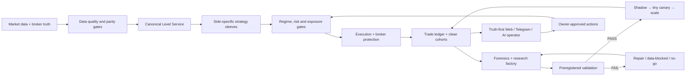

# PROJECT SYSTEM AND ROADMAP — 2026-07-10

Статус: **каноническая операционная карта проекта**. Если другой отчёт, старый чат или AI-текст противоречит этой карте, сначала проверяется источник и timestamp, затем обновляется эта карта и `PROJECT_STATE_LEDGER.md`.

## Update 2026-07-11 — causal FX frame and honest negative gate

Newest checkpoint: `reports/MORNING_RECOVERY_CHECKPOINT_2026_07_11.md`.

- Research frame `376ad21` is pushed, not live-deployed. It adds typed event/plan/cost contracts, DST/session/data gates, synthetic bid/ask execution, gap/censor handling, signal ledger, folds/holdout/LOSO, and physically separate long/short evaluation.
- Three new FX/CFD families were tested once with frozen parameters. All six directions failed in base and stress; final state is `REPAIR`, never shadow/demo/live.
- Current FX source data cannot satisfy promotion gates. Diagnostic-only evidence is allowed solely after complete-H1 filtering and segment resets; XAU remains data-blocked.
- The old InPlay maker is frozen after independent-symbol failure. Crypto successors must use persisted event lifecycle and separate long expansion versus short exhaustion contracts.
- Alpaca is safe-hold, not profit-optimized. Broker-stop protection continues while the corrupt intraday ledger is rebuilt from fills.

Roadmap priority is now evidence repair, not strategy count: rebuild ledger/data truth, implement one causal change per V3 candidate, prereg before outcomes, and advance only strict PASS to risk-zero shadow.

## 1. Миссия и честная цель

Мы строим не «бота с одной стратегией», а управляемую мульти-рыночную станцию:

- Bybit crypto;
- Alpaca equities;
- FX/CFD после data/cost/OOS gates;
- позже DeFi, funding/carry, арбитраж и другие контуры.

Цель системы — находить, проверять, запускать, сопровождать и останавливать денежные рукава. Она должна быть наблюдаемой, восстанавливаемой после рестарта, управляемой на расстоянии и способной улучшать исследовательский процесс. Самоизменение live-кода или риска без проверки и owner approval не является допустимой «автономностью».

Стабильный доход — желаемый бизнес-результат, но не обещание стратегии и не календарная дата. Первый инженерный результат — перестать терять правду и время; первый quant-результат — получить повторяемый edge; первый денежный результат — доказать его на чистом live-потоке с малым риском.

## 2. Иерархия источников правды

При конфликте используются источники сверху вниз:

1. Прямой broker/exchange state: позиции, ордера, fills, equity.
2. Свежий heartbeat и effective runtime config с timestamp и git revision.
3. Clean live cohort после зафиксированного deployment/telemetry boundary.
4. Пререгистрированный research artifact с data manifest, costs и OOS.
5. Локальные snapshots, TG/web summaries.
6. LLM/AI-интерпретация. Она не является источником фактов.

Любое число в UI, TG или AI-контексте должно иметь:

- `observed_at`;
- `source`;
- `freshness/status`;
- `cohort/version`;
- `effective`, `proposed` или `historical` semantics.

## 3. Карта системы

## 4. Текущая денежная правда

### Crypto / Bybit

- Последний прямой check: около `1020 USDT`, flat, `bybot.service=active`.
- Единственный денежный crypto sleeve: `ATT1 short r001`, `risk_mult=0.10`.
- `flat`, `range`, `breakdown`, `bounce`, `IVB1`, `Inplay` и остальные видимые модули не являются текущими денежными рукавами при `risk_mult=0`.
- Повышение риска запрещено до чистого live evidence и строгого мета-фильтра.

### Equities / Alpaca

- Малый live canary около `$500`.
- Последняя проверка: equity около `$488.58`; открытые позиции имели broker-side stops.
- Research return monthly v36 нельзя называть live-доходностью.
- Intraday v1/v3 имели runtime/observability defects; локальные исправления готовы, но ещё не deployed и не подтверждены на сервере.

### FX/CFD

- Денег и demo-capital allocation нет.
- Валидный H1 research cache есть для `EURUSD`, `GBPUSD`, `USDJPY`.
- `XAUUSD` остаётся data-quality blocked в текущем строгом контуре.

## 5. ATT1: сломана стратегия или тестовая система

Короткий вердикт: **ни «стратегия точно сломана», ни «всё нормально» сейчас не доказано**. Найдено две разные проблемы.

### 5.1 Что произошло в live

Clean r001 cohort после `ATT1_EDGE_START_TS` содержит четыре закрытия:

- BTC: SL `-0.4942`;
- ADA: manual profit `+1.3645`, загрязнён execution incident и не считается автономной победой;
- LTC: SL `-0.3983`, runner был, MFE около `0.34R`;
- DOT: SL `-0.4598`, runner был, MFE около `0.37R`.

Итог `+0.0121` создаётся ручным ADA-close. Три автономных завершения дали около `-1.3523`. Это плохой ранний сигнал, но `N=4` недостаточно для verdict об edge.

BTC/LTC/DOT прошли текущий entry predicate. У ATT1 в forensic report нет `missing_candles`. Для LTC/DOT нет доказательства повторения runner bug: цена просто не дошла до `1R`, где включаются BE/trailing.

### 5.2 Что было неправильно в TG AI-отчёте

Rolling report содержит `50` исторических сделок разных эпох и конфигураций. `29` записей с `missing_candles` означают отсутствие свечей в локальном post-hoc forensic cache, а не отсутствие свечей у live-бота и не невозможность закрыть позицию. Расклад: range `21`, breakdown `7`, flat `1`; ATT1 `0`.

Внутренний AI смешал legacy cohort, current r001 и отдельный IVB1 backtest, затем выдал причинный диагноз, которого данные не подтверждали. Локальный weekly report теперь всегда выводит deterministic data contract, inject-ит runtime truth и запрещает такие выводы в prompt.

### 5.3 Почему нельзя просто запретить chop

ATT1 exit/regime A/B уже проверил эту гипотезу:

- base/all-regimes: `379` trades, `+18.78R`, `PF=1.277`, `4/4` positive folds;
- trend-only: только `2/4` positive folds;
- early BE и pure trail также не победили baseline.

Поэтому простой `bear_trend only` или `trend_only` patch был бы подгонкой после нескольких убытков. Следующий эксперимент — causal entry-quality meta-filter, который пытается сохранить baseline и заранее отсеять low-MFE false starts.

### 5.4 Следующий ATT1 gate

Для каждой исторической и новой clean сделки сохраняется entry card:

- side и strategy version;
- horizontal/sloped level provenance;
- slope, R², число pivots, age, touch distance;
- RSI, ATR expansion/compression;
- BTC/market regime и symbol-specific level respect;
- MFE/MAE, stop-then-reverse, cost, exit reason;
- broker fill/parity fields.

Дальше: frozen baseline → time folds → symbol/OOS → cost stress → ablation. Модель может быть простым ruleset/деревом; LLM не принимает directional решение. При `N<20` clean live verdict запрещён.

## 6. Уровни и разделение long/short

Отдельная система уровней есть, но сейчас это несколько частично пересекающихся систем:

- `bot/market_context.py`: horizontal clusters, sloped trendlines, pivots, ATR, HVN/VWAP/flip context;
- `bot/unified_levels.py`: typed horizontal/sloped/HVN/flip/liquidity/round contract;
- `bot/chart_geometry.py` + `scripts/build_geometry_state.py`: geometry snapshot для setup cards/web;
- `bot/level_memory.py`: реакции bounce/sweep/break и respect score;
- `scripts/render_levels.py`: standalone human QA rendering.

Проблема не в отсутствии рисования, а во фрагментации: разные стратегии используют разные вычислители, а `unified_levels` не является обязательным входным контрактом.

### Target: Canonical Level Service v2

Один versioned output на `symbol × timeframe × observed_at`:

- horizontal support/resistance clusters;
- sloped support/resistance с pivots, R², slope и validity;
- flip/broken levels;
- liquidity pools и sweep/break state;
- round/big-figure levels с instrument-specific step;
- level-memory respect и sample size;
- quality, age, provenance и invalidation reason.

Один и тот же payload должен идти в research, live signal, web chart, TG entry card и forensic replay. Parity test сравнивает levels/signals на одинаковых свечах.

Long и short не зеркалятся автоматически. Каждый имеет отдельные:

- strategy id/config;
- allowlist;
- entry/exit parameters;
- OOS verdict;
- breaker, risk и live cohort.

## 7. Что делать с пилой, отскоками, Elder и Inplay

### Пила / mean reversion

Broad z-score MRB — failed baseline (`PF≈0.84`, `0/4` folds). Это не смерть идеи диапазона, а запрет на повтор того же теста. Новый sleeve строится как level event:

1. range/filter определяет пригодный рынок;
2. quality level + level-memory подтверждают, что инструмент уважает уровень;
3. sweep/reclaim или exhaustion/failed-breakout даёт событие;
4. maker/retest entry не догоняет цену;
5. long support и short resistance валидируются отдельно.

### Отскоки

Support-reclaim в текущем виде дал нулевые/слишком редкие сигналы. Ремонт: единый level payload, `retest_quality`, `liquidity_sweep`, causal symbol respect и asymmetric R:R. Не включать raw bounce только потому, что цена «у поддержки».

### Elder

Elder — confluence filter, не самостоятельный денежный двигатель. Он разрешает long/short по tide/wave поверх уже валидного setup. Его ценность проверяется A/B: base sleeve vs base+Elder на тех же сделках, costs и folds.

### Inplay

Signal pulse был: base taker result выглядел положительно, но stress costs съели edge. Maker-cost proxy подтвердил cost-drag; настоящий maker-fill gate не прошёл prereg (`PF=1.173` против `1.2`, `2/4` folds). Следующий ремонт — не ещё один grid, а level-memory/entry-quality + реалистичная очередь/fill probability. До PASS рукав frozen в research.

## 8. FX/CFD: что уже возможно

### Исправление рамы

В `bot/fx_setups.py` были структурные ошибки:

- `trend_pullback` оценивал текущую цену как «уровень»;
- `trend_pullback` и `session_breakout_retest` не передавали touch/freshness metadata;
- при H1 volume proxy `0` максимальный quality оказывался ниже default threshold;
- полный prefix пересчитывался на каждом баре, создавая дорогую O(n²) работу.

Локально исправлено:

- trend pullback использует `best_retest` реального уровня;
- horizontal breakout-retest передаёт touches/last-touch;
- sloped breakout-retest fail-closed до отдельного sloped metadata contract;
- geometry ограничена causal rolling windows;
- targeted FX suite проходит.

### Первые числа после ремонта

Один фиксированный H1 smoke (`RR=2.0`, `SL=1 ATR`, hold `120`) — диагностика, не prereg:

| Pair | Setup | Trades | Net R | PF | Folds+ | Статус |
|---|---|---:|---:|---:|---:|---|
| USDJPY | trend_pullback | 40 | -0.284 | 0.990 | 2/4 | достаточно частоты для строгого gate, edge не показан |
| EURUSD | trend_pullback | 33 | -9.169 | 0.688 | 1/4 | reject текущую строку |
| GBPUSD | trend_pullback | 30 | -10.745 | 0.592 | 0/4 | reject текущую строку |
| USDJPY | horizontal breakout-retest | 12 | -6.139 | 0.475 | 1/4 | reject текущую строку |

### Лучший старый FX lead и важная поправка

Старый `USDJPY round_level_sweep` (`RR=2.5`, `SL=1 ATR`) дал `30` сделок, `+5.9756R`, `PF=1.265`, `3/4` folds. Но текущий `_round_levels` строит для USDJPY шаг `10 JPY`, то есть это big-figure/decade-handle event, а не обычные FX `00/50` уровни.

Side split показывает, что весь pulse short-driven:

- short: `18` trades, `+10.6487R`, `PF=1.946`;
- long: `12` trades, `-4.6731R`, `PF=0.587`.

Это основание для **нового пререгистрированного short-only теста**, не готовая стратегия.

### Три следующих FX теста

1. Freeze `USDJPY big-figure sweep short-only` до просмотра нового holdout: fixed RR/SL/hold, chronological OOS, spread/slippage stress, session/news split.
2. Отдельно определить instrument-aware `00/50` levels и проверить как новую гипотезу без смешивания с big-figure result.
3. Repaired trend-pullback и horizontal breakout-retest запускать side-specific с фиксированными quality parameters; sloped retest — только после отдельного metadata/parity contract.

## 9. Alpaca: доделывать, но не романтизировать

Monthly research выглядит сильнее crypto, но live canary пока не подтвердил доходность. План:

1. Deploy и проверить исправление close reconciliation (`base_url` NameError).
2. Проверить executable v3 shadow launcher и cron heartbeat.
3. Разделить ledger/PnL: monthly, intraday v1, intraday v3, manual/unknown.
4. Для каждой позиции показывать broker stop, strategy owner, entry reason и stale age.
5. Не добавлять капитал до достаточного чистого live-периода и reconciliation fills.

## 10. AI: где он реально может дать преимущество

Полезные роли AI:

- связывать live evidence, code/config и research verdict;
- кластеризовать причины убытков и готовить prereg hypotheses;
- искать anomalies, stale data и parity breaks;
- генерировать code/tests/reports под человеческий review;
- после сотен собственных размеченных сделок — meta-labeling/position-quality ranking.

Опасные роли:

- LLM предсказывает следующую свечу;
- включает рукав по setup card или tiny-N;
- меняет риск/код без gate и owner approval;
- объявляет backtest доходом или mixed cohort текущей стратегией.

AI proposal проходит тот же pipeline, что человеческая идея. Автономность означает автоматическое обнаружение, диагностику, safe restart/recovery и подготовку решения — не самостоятельное повышение риска.

## 11. Web и Telegram: truth-first contract

Уже локально:

- weekly AI forensics получает обязательный cohort/cache contract;
- AI full-context direct script import исправлен;
- web trading mutations (`enable/disable`, safe mode, reload/SIGHUP) blocked fail-closed, потому что live consumer/ack отсутствует;
- legacy web overlay маркируется `historical_non_effective_proposal`;
- backtest web action честно пишет только operator-review inbox, автоматического consumer пока нет.

Target control protocol:

1. `request_id`, desired state, user, reason, expiry.
2. Validator проверяет owner role, open positions, stops, gate evidence и version.
3. Live consumer применяет только allowlisted mutation.
4. Bot пишет `effective_state_ack` с old/new, timestamp и git/config hash.
5. UI показывает success только после ACK; иначе `pending`, `rejected` или `expired`.

## 12. VPS и грязный repository

VPS отстаёт от local HEAD на шесть commits, а server tree содержит untracked archives, backup-env и вручную доставленные файлы. Это нельзя «лечить» массовым delete/reset.

Добавлен read-only `scripts/build_repo_drift_manifest.py`: он не читает содержимое и ничего не перемещает/удаляет. После изменений этой сессии локальный manifest видит `382` status records: `36` manual-code candidates, `14` runtime/log, `7` archives/backups и `14` secret-like filenames. Последняя категория основана только на имени и требует review; это не утверждение, что содержимое действительно секретно.

VPS manifest теперь тоже снят: `877` records, но только `2` tracked changes. Это два generated artifacts: свежий Alpaca intraday watchlist и allocator snapshot. Первый надо воспроизвести/сохранить; второй раскрыл старый fail-open baseline. Локальный `approved_strategy_params.env` уже исправлен: только ATT1 short r001 имеет положительный base risk `0.10`, все остальные sleeve risk равны нулю. Полная раскладка и безопасная последовательность: `reports/SERVER_REPO_NORMALIZATION_PLAN_2026_07_10.md`.

Порядок нормализации:

1. Только в flat window снять direct broker snapshot, service/cron/process inventory и checksums.
2. Запустить read-only server file manifest: tracked modification / runtime state / log / secret-like backup / manual code / archive.
3. Secret backup вынести из repo в permissioned directory; demo MT5 password ротировать.
4. Сохранить unique manual code как patch/commit или явно признать obsolete.
5. Архивы переместить в quarantine outside repo; удалять только после owner-reviewed manifest.
6. Deploy один reviewed commit/fast-forward, запустить targeted+fast tests.
7. Restart только flat; затем проверить broker positions/stops, heartbeat git rev, cron и web/TG freshness.

Локальные fixes этой сессии не deployed, не меняют live risk и не размещают orders.

## 13. Исследовательская фабрика: чтобы время не пропадало

Каждый run получает immutable manifest:

- hypothesis и binding failure предыдущей версии;
- data source/hash/coverage/timezone;
- train/test/holdout boundary;
- strategy code/config hash;
- side, symbols и regime;
- fees/slippage/fill model;
- prereg pass/fail criteria;
- wall time/compute budget;
- verdict и следующий допустимый action.

Финальные состояния только:

- `LIVE_CANARY`;
- `SHADOW`;
- `REPAIR`;
- `DATA_BLOCKED`;
- `NO_GO`.

Запрещено бесконечно перезапускать один FAIL-grid. Новый run обязан менять причинную гипотезу, данные или execution model. Long scan без progress/ETA/early-stop останавливается.

## 14. План выхода из кризиса и сроки

Сроки — planning ranges при нормальном доступе к машине/VPS, а не обещание доходности.

### Сейчас — 1–2 сессии

- закончить canonical memory/report;
- review локальных P0 fixes;
- получить clean deploy diff и server quarantine manifest;
- не менять live risk.

**Exit:** новый чат за 10 минут понимает live money, доказательства, блокеры и следующие три действия; ни TG, ни web не называют proposal effective state.

### 3–7 дней

- безопасно синхронизировать VPS в flat window;
- подтвердить Alpaca v1/v3 cron/fills/stops;
- собирать ATT1 entry cards и clean cohort;
- выполнить USDJPY short-only prereg и первый bounded crypto level-memory repair.

**Exit:** reproducible operations + минимум два строгих research verdict, даже если оба FAIL.

### 1–2 недели

- Level Service v2 contract + parity tests;
- side-specific pila/bounce repair;
- ATT1 entry-quality frozen experiment;
- research queue с budgets/early-stop/status.

**Exit:** один и тот же level/signal объясняется одинаково в backtest, live, web и forensics.

### 2–4 недели

- при PASS вывести максимум один crypto и один FX/equity candidate в shadow;
- если PASS нет, получить доказанный NO_GO/REPAIR без добавления live риска;
- broker execution parity для прошедших shadow candidates.

**Exit:** 1–2 настоящих shadow candidates либо честное доказательство, почему их пока нет.

### 6–12 недель

- накопить clean live/shadow sample;
- оценить expectancy, drawdown, costs, uptime и recovery;
- только после этого решать scale/pause/replace.

**Exit:** решение о масштабировании основано на live-quality evidence, а не на надежде.

Стабильный семейный доход нельзя честно привязать к сроку. При капитале порядка `$1.5k` даже положительный edge даст небольшую абсолютную сумму; попытка ускорить её плечом разрушит шанс выжить. Сначала доказывается процесс и edge, затем отдельно решается вопрос капитала и масштаба.

## 15. Definition of Done для «рамы»

Рама считается зрелой, когда:

- broker truth автоматически reconciled с ledger;
- clean cohorts versioned;
- long/short физически и статистически разделены;
- levels едины для research/live/UI;
- every live sleeve имеет SL, breaker, expiry и owner;
- deploy atomic/reversible и отражает git rev;
- web/TG никогда не выдают stale/proposal за effective;
- research queue умеет early-stop и сохраняет verdict;
- AI не может обойти gates;
- restart/recovery проверен без потери strategy state.

## 16. Правило продолжения для каждого нового чата

Сначала прочитать:

1. этот документ;
2. `PROJECT_CANONICAL_INDEX_2026_07_10.json`;
3. последние секции `PROJECT_STATE_LEDGER.md`;
4. текущий `git status` и последний runtime/server snapshot.

Затем сообщить владельцу:

- что реально live money;
- что изменилось после предыдущей сессии;
- какие факты устарели;
- какие ровно три действия выполняются сейчас.

В конце сессии обязательно:

- обновить `as_of`, `last_session` и `next_actions` в canonical index;
- append-only записать изменения/вердикты в ledger;
- добавить evidence paths и test results;
- не переписывать старый FAIL как новую идею без новой гипотезы.

## 17. Следующие три действия

1. Review → commit → flat-window deploy локальных truth/P0 fixes и VPS normalization manifest.
2. ATT1 entry-card builder + causal meta-filter prereg без изменения live config.
3. USDJPY big-figure sweep short-only prereg и bounded level-memory sweep/reclaim repair.
